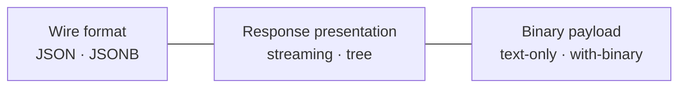

# Composition: wire format × response presentation × binary payload

`note-cpp` exposes three orthogonal axes of behaviour. They were once tangled together in the implementation and in the user-facing docs — picking one used to constrain the others. After the JSONB + tree rework that shipped in v0.3, each axis is an independent choice that the rest of the API surface does not see.

This page names the axes, lays out the matrix of combinations, and points at the examples for each cell.

## The three axes



1. **Wire format** — JSON text (`{"req":"card.version"}`) or JSONB binary opcodes (`{:<COBS opcodes>:}\n`). Selected by the `NOTE_JSONB` compile flag; the typed API surface is identical on both. See [`jsonb.md`](jsonb.md).
2. **Response presentation** — *streaming*, where a SAX parser fires events directly into your typed `Response` and into `.into(struct)` sinks, or *tree*, where a `JsonBackend` assembles a walkable `JsonReader` you can query by key after the call. Selected by which `Notecard` constructor you call. See [`streaming-and-tree.md`](streaming-and-tree.md).
3. **Binary payload** — text-only requests, or requests carrying binary buffers (`card.binary.put`/`get`, large `note.add` bodies). Selected per-call by whether you attach a buffer with `.data(buf, len)` or `.into(buf, len)`. See [`binary-transfer.md`](binary-transfer.md).

## The matrix

The wire-format and presentation axes form a 2×2 matrix. Every cell is supported and tested — host parity tests live in `tests/integration/cjson/test_tree_jsonb.cpp` and `tests/integration/{cjson,nlohmann,buffer}/test_*_backend.cpp`; hardware coverage runs on the `serial`, `serial-jsonb`, `i2c`, `i2c-jsonb` HIL environments.

| Presentation ↓ \ Wire → | **JSON** | **JSONB** |
|---|---|---|
| **Streaming** (no backend) | typed API → SAX → `Response` struct + `.into(T&)`. Smallest flash, zero heap. | typed API → JSONB parser → SAX → `Response` struct + `.into(T&)`. Default for `NOTE_MINIMAL`. |
| **Tree** (`JsonBackend`) | typed API + `r.body()` walkable. Lambda request builder available. | typed API + `r.body()` walkable. Lambda request builder available. Backend assembles the tree from SAX events. |

The third axis — binary payloads — lives perpendicular to this matrix. `card.binary.put().data(buf, len).execute()` and `card.binary.get().into(buf, len).execute()` work in every cell. The COBS-framed binary channel sits next to the JSON/JSONB request channel, not inside it.

## Why the axes are now independent

Prior to v0.3, the buffered response path was tied to JSON text — the backend's outgoing builder produced JSON, and the response path called `parse_response(string_view)`, which only knew JSON. JSONB users had to pair `NOTE_JSONB=1` with `NOTE_NO_JSON_TREE=1` to avoid a broken intersection. The pairing was documented as a rule but enforced only by convention.

The rework routes the buffered response decode through the same SAX dispatch the streaming path uses — `JsonBackend::start_response()` returns a `JsonSink&`, the transport feeds events into it, and `finish_response()` returns the assembled reader. The wire format is now entirely inside the transport, and the presentation is entirely inside the backend. They compose by construction.

The remaining `NOTE_JSONB` and `NOTE_NO_JSON_TREE` flags are still useful as size-optimization presets — they reduce the binary by deleting unused paths — but the *intersection* of "JSONB wire + tree presentation" now works without flag pairing.

## Example combinations

`examples/stdcpp/wire-format-and-presentation.cpp` walks the 2×2 matrix in one program, running the same demo code against four configurations and showing the differences in usage. Run it host-side without a Notecard connected:

```bash
c++ -std=c++20 -I include examples/stdcpp/wire-format-and-presentation.cpp && ./a.out
```

The other examples cover a single cell each but are useful when you want to see one combination in isolation:

| Cell | Example |
|---|---|
| JSON × streaming | [`getting-started.cpp`](../examples/stdcpp/getting-started.cpp), [`zero-alloc.cpp`](../examples/stdcpp/zero-alloc.cpp) |
| JSON × tree | [`streaming-and-tree.cpp`](../examples/stdcpp/streaming-and-tree.cpp) (the tree-mode passes), [`note-c-bridge.cpp`](../examples/stdcpp/note-c-bridge.cpp) |
| JSONB × streaming | Set `NOTE_JSONB=1` on the [`getting-started.cpp`](../examples/stdcpp/getting-started.cpp) build line |
| JSONB × tree | [`wire-format-and-presentation.cpp`](../examples/stdcpp/wire-format-and-presentation.cpp) (the JSONB tree passes) |
| Any cell + binary payload | [`binary-transfer.md`](binary-transfer.md), [`card.binary` API](api-reference.md#cardbinary) |

## Picking a combination

The defaults are tuned for the platform you're targeting:

- **Tiny MCU** (AVR, RP2040 Cortex-M0, smaller ESP32): `NOTE_MINIMAL` → JSONB × streaming, no backend linked. Smallest possible binary, zero heap, no tree code at all.
- **Mid-range MCU** (most ESP32 / STM32 builds): JSON × streaming with `.into(struct)` for body parsing. The default `Notecard nc(transport)` ctor. Zero heap, predictable, no backend dependency.
- **Capable host** (POSIX, ESP32-with-PSRAM, anywhere with heap budget): JSON × tree with `CjsonBackend` for the post-call body-walk API. Pair with `nlohmann::json` if you already depend on it.
- **JSONB-aware host firmware**: pick the wire format on the wire (`NOTE_JSONB=1`) for smaller payloads on bandwidth-sensitive links. The presentation is still your choice.
- **Binary transfers**: orthogonal to all of the above — `card.binary.put` / `get` work in every cell.

If you're not sure which to start with, follow [`getting-started.md`](getting-started.md) — it walks the most common path (JSON × streaming) and points at the alternatives where they apply.

## See also

- [`jsonb.md`](jsonb.md) — wire format details, opcode constants, size comparison
- [`streaming-and-tree.md`](streaming-and-tree.md) — presentation details, when each mode matters
- [`json-backend.md`](json-backend.md) — backend selection (`CjsonBackend`, `StaticJsonBackend`, `NlohmannBackend`, `CjsonArenaBackend`)
- [`binary-transfer.md`](binary-transfer.md) — binary payload axis, COBS framing
- [`feature-flags.md`](feature-flags.md) — `NOTE_JSONB`, `NOTE_NO_JSON_TREE`, `NOTE_MINIMAL` and how they map to the matrix
