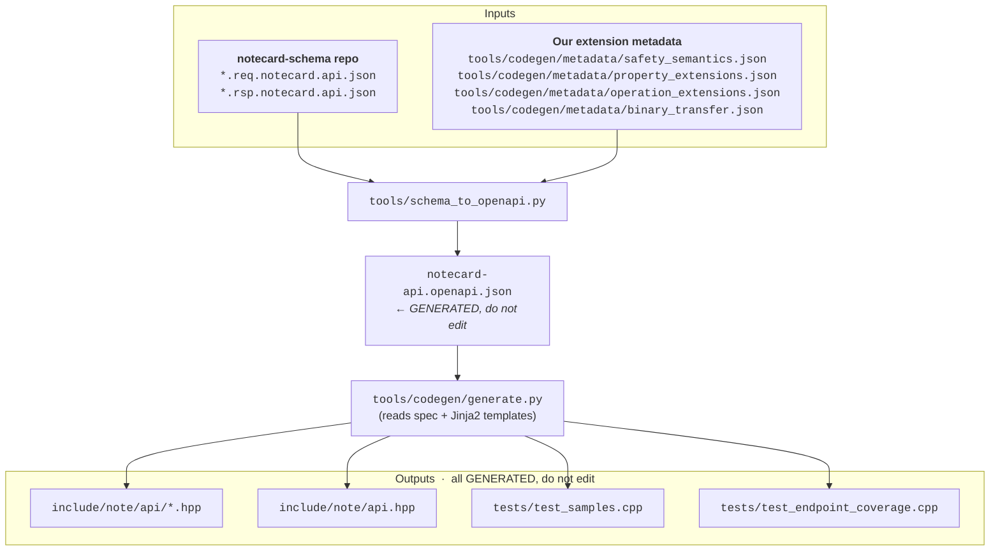

# Code Generation Pipeline

**`notecard-api.openapi.json` and all files in `include/note/api/` are generated — never edit them directly.**

Both are transient artifacts rebuilt from source. Any direct edits are overwritten on next regeneration.
All changes belong in the source files described below.

## Pipeline Overview



## Source Files

### Blues upstream schema (external)

`*.req.notecard.api.json` and `*.rsp.notecard.api.json` files from the
[notecard-schema](https://github.com/blues/notecard-schema) repo define the
raw request/response property shapes for each Notecard API endpoint.

### `tools/codegen/metadata/safety_semantics.json`

Maps each endpoint to HTTP method(s) (GET/PUT/POST/DELETE), encoding the
safety/idempotency class and, for polymorphic endpoints, the field constraints
(`requires`, `excludes`) that determine which HTTP verb applies.

This is also how `x-dispatch` polymorphism is expressed: an endpoint with
multiple HTTP methods generates multiple C++ operation structs.

### `tools/codegen/metadata/property_extensions.json`

Per-property extension overrides. Keys are endpoint names; values map
property wire-names to extension objects merged into the property schema.

Used for:
- `x-format: "voltage-variable"` — structured voltage/current fields
- `x-toggle` — paired boolean fields with semantic method names
- `x-action` — standalone boolean trigger with a semantic method name

### `tools/codegen/metadata/operation_extensions.json`

Per-operation extension overrides. Keys are endpoint names; values map
HTTP method (lowercase) to extension objects merged into the operation.

Used for:
- `x-intents` — intent definitions (arm/sleep/retrieve etc.) that expand into per-intent C++ structs
- `x-intent-name` — rename a dispatch operation's factory method and struct (e.g. `get` → `read`)

### `tools/codegen/metadata/binary_transfer.json`

Annotates endpoints that follow JSON handshake with raw COBS binary data.

### `tools/schema_to_openapi.py`

The converter. Reads upstream schema files and merges all extension metadata
into a single `notecard-api.openapi.json`. Two modes:

**Full regeneration** (when Blues schema files change):
```bash
python3 tools/schema_to_openapi.py <notecard-schema-dir> \
    --safety tools/codegen/metadata/safety_semantics.json \
    --binary tools/codegen/metadata/binary_transfer.json \
    --extensions tools/codegen/metadata/property_extensions.json \
    -o notecard-api.openapi.json
```

**Apply extensions only** (without full regeneration — faster when only
extension metadata has changed):
```bash
python3 tools/schema_to_openapi.py update-extensions notecard-api.openapi.json \
    --extensions tools/codegen/metadata/property_extensions.json \
    --op-extensions tools/codegen/metadata/operation_extensions.json
```

### `notecard-api.openapi.json`

**Generated — do not edit directly.** This file is a transient build artifact
produced by `schema_to_openapi.py`. Any manual edits are overwritten on next
regeneration. Add metadata to one of the extension files above instead.

Operation-level extensions (`x-intents`, `x-intent-name`) are sourced from
`tools/codegen/metadata/operation_extensions.json` and applied during both full regeneration
and `update-extensions`.

### `tools/codegen/generate.py`

Reads the OpenAPI spec and renders Jinja2 templates to produce C++ headers
and test files. Also runs the spec parser and applies naming conventions.

Run to regenerate all files after spec or template changes:

```bash
python3 tools/codegen/generate.py
```

### `tools/codegen/spec_parser.py`

Parses the OpenAPI spec into an intermediate model (`model.py`). Handles:
- Property type mapping (OpenAPI → C++)
- x-dispatch polymorphism
- x-intents expansion into per-intent operation structs
- x-toggle / x-action semantic method metadata
- Array fields, unit types, voltage-variable formats, flags

### `tools/codegen/templates/`

Jinja2 templates:
- `endpoint.hpp.j2` — per-endpoint header with request builder + response parser
- `api.hpp.j2` — umbrella `Api` factory with all resource groups
- `test_endpoint_coverage.cpp.j2` — one builder + parser test per operation
- `test_samples.cpp.j2` — sample-driven wire-format tests from `x-samples`

## Adding New Metadata

### New property extension (x-toggle, x-format, etc.)

1. Add to `tools/codegen/metadata/property_extensions.json` under the endpoint and property name
2. Extend `tools/codegen/spec_parser.py` to read the new key in `_parse_property()`
3. Add a field to `tools/codegen/model.py` `PropertyDef` if needed
4. Update `tools/codegen/templates/endpoint.hpp.j2` to emit the new behavior
5. Regenerate: `python3 tools/codegen/generate.py`

### New safety/dispatch rule

1. Add/update `tools/codegen/metadata/safety_semantics.json`
2. Regenerate the OpenAPI spec via `schema_to_openapi.py`
3. Regenerate C++ via `generate.py`

### New operation-level extension (x-intents, x-intent-name)

1. Add to `tools/codegen/metadata/operation_extensions.json` under the endpoint and HTTP method
2. Run `python3 tools/schema_to_openapi.py update-extensions notecard-api.openapi.json`
3. Run `python3 tools/codegen/generate.py notecard-api.openapi.json` to regenerate C++
