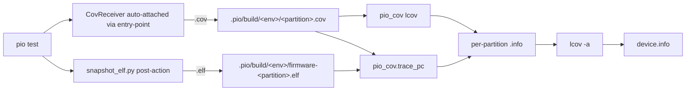

# Test Coverage

## Running coverage

```bash
./ci.sh --coverage
```

Generates `coverage/html/index.html` and prints a summary including lines, functions, and branches.

## Expected results

| Metric | Coverage |
|--------|----------|
| Lines | ~98.5% |
| Functions | ~99.9% |
| Branches | ~98.9% |

## Device coverage (integration firmware)

The on-device integration suite at `tests/integration/firmware/` produces its own coverage data, complementing the host suite. Backends behind abstraction layers (cJSON, nlohmann) that the host suite mocks out are only meaningfully exercised by device tests.

### One-shot run

```bash
cd tests/integration/firmware
source boards.sh 1.9        # or your board
./ci.sh --coverage --upload-port "$PLATFORMIO_UPLOAD_PORT" --test-port "$PLATFORMIO_UPLOAD_PORT"
```

Output lands in `tests/integration/firmware/coverage/`:

| File | Backend | Contents |
|------|---------|----------|
| `test_fixtures.info` | gcov | full line+branch detail (fits DRAM) |
| `test_units_b.info` | trace-pc | line-hit set (gcov DRAM-overflows here) |
| `test_units_c.info` | trace-pc | line-hit set (gcov DRAM-overflows here) |
| `device.info` | merged | `lcov -a` of all three |

`test_units_a` is skipped from the coverage flow: it doesn't compile under the coverage envs (`Wire.h` lookup issue, pre-existing). Host coverage exercises those tests.

### How it works



1. `pio-cov`'s `CovReceiver` auto-attaches via the `embedded_test_runner.receivers` setuptools entry-point group. When `pio-cov` is `pip install`-ed in PIO's penv, `pio-test-runner`'s `EmbeddedTestRunner` discovers and attaches it on construction. The receiver intercepts `COV:` lines from the device serial stream and writes them to a per-partition side file (PIO's default test-output filter would otherwise drop non-test-pattern lines).
2. `snapshot_elf.py` (a project-side PIO post-link action wired into the trace-pc env) preserves `firmware-<partition>.elf` so trace-pc decode pairs each bitmap with its matching ELF (`firmware.elf` is overwritten between partitions).
3. `pio_cov lcov` decodes gcov-backend `.cov` → `.info` (full detail). `pio_cov.trace_pc` decodes trace-pc `.cov + .elf` → `.info` (line hits only).
4. `lcov -a` merges into `device.info`.

`tests/integration/firmware/test/test_custom_runner.py` is just `class CustomTestRunner(EmbeddedTestRunner): pass` — no project-side receiver code. The auto-attach mechanism removed the need for the hand-rolled `_LineCapture` workaround that lived there briefly during development.

### Manual decode

For one-off conversions (e.g. against a `.cov` from an earlier run):

```bash
# gcov backend
python3 -m pio_cov lcov \
    --build-dir .pio/build/serial-coverage \
    --log .pio/build/serial-coverage/test_fixtures.cov \
    --output coverage/test_fixtures.info

# trace-pc backend
python3 -m pio_cov trace-pc \
    --elf .pio/build/serial-coverage-tracepc/firmware-test_units_b.elf \
    --log .pio/build/serial-coverage-tracepc/test_units_b.cov \
    --output coverage/test_units_b.info
```

`ci.sh --coverage` prefers a pip-installed `pio_cov`; if it's not importable, falls back to `PYTHONPATH=$PIO_COV_ROOT` (default `$HOME/e/pio-gcov` — the checkout directory is still named `pio-gcov` during the rename).

### Merging with host coverage

```bash
lcov -a coverage/coverage.lcov \
     -a tests/integration/firmware/coverage/device.info \
     -o coverage/combined.info \
     --ignore-errors inconsistent,inconsistent,unsupported,format,format
```

### Stack budget caveat

The Arduino `loopTask` stack is bumped to 16 KB on the coverage envs (default 8 KB). Heavily-templated test code under `-fsanitize-coverage=trace-pc` adds enough per-frame overhead to overflow the default — see `pio-cov/docs/issues/2026-05-01-tracepc-dump-crash-esp32s3.md`. The build flag is in `tests/integration/firmware/platformio.ini` on both `[env:serial-coverage]` and `[env:serial-coverage-tracepc]`.

## Branch coverage and exception paths

GCC instruments C++ exception-unwinding paths as branches even when code is
`noexcept` or never throws. These appear as `block=e0` branches in the tracefile
and are structurally unreachable in normal testing — they represent stack cleanup
paths, not program logic.

`ci.sh` passes `--rc no_exception_branch=1` to `lcov --capture` to strip these.
Without this flag, branch coverage appears as ~77% due to ~914 unreachable
exception branches across the header-only codebase. With it, the remaining ~36
missed branches are real program logic gaps.

## Why GCC is required for accurate results

`./ci.sh --coverage` prefers GCC (`g++-13` / `g++-14`) over clang. The two toolchains
differ significantly in how they handle `consteval` functions:

| Toolchain | `consteval` functions | Result |
|-----------|----------------------|--------|
| GCC `--coverage` (gcov) | Marked `-` (non-executable) | Correct — excluded from metrics |
| Clang `-fprofile-instr-generate` | Instrumented but never called | **False positives** — appear as uncovered |

This project uses `static consteval` member functions for compile-time string
validation in every API endpoint (e.g. `validatedMode()`). With clang these show
as uncovered, inflating the function miss count by roughly 30 functions (~10–12%
of the function total).

## Why `lcov --capture` (not genhtml) handles LCOV_EXCL correctly

The lcov file format tracks line coverage (`DA:` records) and function coverage
(`FN:`/`FNDA:` records) separately. `genhtml` applies `LCOV_EXCL_START/STOP`
source annotations to `DA:` records only — function entries are unaffected, so
uncovered functions remain in the function count even when their lines are excluded.

`lcov --capture` applies `LCOV_EXCL` markers at collection time, removing both
line and function entries. This is why the GCC pipeline (which uses `lcov --capture`)
gives clean function coverage numbers, while a clang+genhtml pipeline does not.

## Dependencies

### GCC

**macOS (Homebrew):**
```bash
brew install gcc
```

**Ubuntu / GitHub Actions:**
```bash
sudo apt-get install g++-13
```

The script will find `g++-14` or `g++-13` automatically. If neither is present it
falls back to clang with a warning.

### lcov 2.x

lcov 1.x has an internal `.gcno` format parser that cannot read the format produced
by GCC 13+, causing `"Overlong record at end of file!"` errors and an empty tracefile.
**lcov 2.x is required.**

**macOS (Homebrew):**
```bash
brew install lcov        # fresh install
brew upgrade lcov        # or upgrade from 1.x
```

**Ubuntu 24.04+:**
```bash
sudo apt-get install lcov   # ships lcov 2.x
```

**Ubuntu 22.04 (GitHub Actions `ubuntu-latest` until mid-2025):**
```bash
# apt ships lcov 1.14; install from the upstream PPA instead:
pip install lcov-python  # or grab the release tarball from github.com/linux-test-project/lcov
```

The script exits with an error if lcov < 2.0 is detected.
