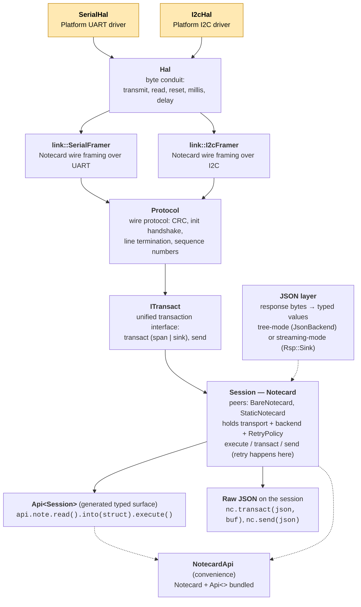

# Streaming Transport

The transport layer exposes a single session interface — `ITransact` —
implemented natively by `Protocol` (streaming, zero-buffer) and by
string-shaped transports (test fakes, the note-c bridge) that override only
the `string_view`-shaped virtuals and inherit `ITransact`'s
materialise-and-forward defaults for the `RequestSource` shape. The streaming
path is the primary design; the string-shaped path exists for test harnesses
and for transports that don't naturally split send/read.

> **Naming note.** "String-shaped" here refers to the transport's *input
> contract* — it receives a fully built `string_view` request rather than a
> streaming `RequestSource`. This is a separate axis from the user-facing
> response-mode distinction ([tree mode vs streaming mode](../transport.md#json-layer-streaming-or-tree)).
> Earlier drafts of this doc called these transports "buffered"; that term was
> dropped to avoid collision with the renamed user-facing terminology.

## Transport Interfaces

### Protocol (primary)

`Protocol : public ITransact` exposes:

```
ITransact
  transact(req, span<char>, timeout) → Result<string_view>  // string request, copy response into buf
  transact(req, JsonSink&, timeout)  → Result<void>         // string request, SAX-parse response
  send(req)                          → Result<void>         // fire-and-forget string

  transact(RequestSource, span<char>, timeout) → Result<string_view>
  transact(RequestSource, JsonSink&, timeout)  → Result<void>
  send(RequestSource)                          → Result<void>

  write(data, len)             → Result<void>     // raw byte write (binary/COBS)
  read(buf, max_len, timeout)  → Result<size_t>   // raw byte read (binary/COBS)
  reset()                                         // drain + resync
  abort()
```

Plus BuildFn-shaped non-virtual entry points (`transact(BuildFn, ctx, sink, timeout)`,
`send(BuildFn, ctx)`, with templated `F&&` convenience wrappers) on `Protocol`
itself, for callers like `StaticNotecard` and tests that want zero-vtable
direct dispatch.

Requests are streamed via a `RequestSource` (or BuildFn callable) that paints
JSON bytes through a `StreamingJsonBuilder` over the wire. Responses are
SAX-parsed directly from the wire into a `JsonSink&`. No intermediate buffers.

### String-shaped transports

Test transports (`note::test::CallbackTransport`, `MockTransport`,
`ScriptedTransport`) and the note-c bridge derive from `ITransact`
directly and override only the `string_view`-shaped virtuals. The
`RequestSource` virtuals on `ITransact` carry default impls that
materialise the source into a stack scratch buffer, append the closing
`}`, and forward to the matching `string_view` virtual — so string-shaped
transports satisfy the full `ITransact` API without per-class
boilerplate beyond their own `transact(string_view, span<char>, t)`
and `send(string_view)` overrides.

## Architecture

The library uses a layered architecture — each layer has one job, and the layer above sees only its predecessor's interface. Reading from the bottom up, the layers are:

1. **`Hal`** — platform byte conduit. `transmit`, `read`, `reset`, `millis`, `delay`, `write_line_terminator`. No protocol logic; just moves bytes. You implement this for your platform (or extend `arduino::SerialHal` / `arduino::I2cHal`).
2. **`link::SerialFramer<Policy>` / `link::I2cFramer<Policy>`** — Notecard wire framing over a byte `Hal`. Handles segment pacing, chunking, drain/reset windows, and I2C MTU negotiation. Owns the `PacingPolicy` — wire-level timing fields (`segment_*`, `intra_timeout_ms`, `reset_*`); runtime-mutable or compile-time `[[no_unique_address]]`. These are themselves `Hal`s — the layer above sees a framing-aware byte conduit.
3. **`Protocol`** — full Notecard wire protocol over a framing `Hal`: CRC validation, init handshake, line termination, sequence numbers. The only concrete protocol driver. No retry — retry lives at the session layer.
4. **`ITransact`** — unified Notecard transaction interface. Three operations: `transact(req, span)` → `string_view`, `transact(req, sink)` → SAX events, and `send(req)` (fire-and-forget). The span and sink forms are *response presentations* (overloads on the same interface), not sibling transports. `Protocol` implements `ITransact` natively. This is the contract a session class holds; the session itself is layer 6.
5. **JSON layer** — turns response bytes into typed values. Tree mode (`JsonBackend` walks a parsed tree) or streaming mode (SAX events fire into `Rsp::Sink`). See [docs/transport.md](../transport.md) for the user-facing mode-selection guide.
6. **Session — `Notecard` (or peer: `BareNotecard`, `StaticNotecard`)** — runtime object holding an `ITransact&`, an optional `JsonBackend&`, a `RetryPolicy`, and inter-transaction timing. Exposes `transact(json, buf)`, `send(json)`, `execute(req)`. Retry happens here, gated by per-request `Safety`. The three session classes are *peers* (alternative entry points), not stacked — pick one; each carries its own retry, so there's no retry-of-retry by construction.
7. **`Api<Session>`** — generated typed surface (`api.note.read().into(struct).execute()`, `api.card.attn.arm().execute()`). Each builder's `.execute()` dispatches to the bound session's `execute(req)` — so typed and raw paths share one retry/transport pipeline.
8. **`NotecardApi` (convenience bundle)** — single object bundling a default `Notecard` + `Api<>` so callers don't have to construct both. The 99% case.

### Approximate OSI mapping

The library's layer structure maps roughly onto the OSI 7-layer model. Useful as a mental model for readers familiar with networking; not a strict claim.

| OSI layer | Concept | note-cpp type |
|---|---|---|
| 1+2 (physical / link) | byte conduit | `note::Hal` (and platform impls: `arduino::SerialHal`, `arduino::I2cHal`, `posix::*Hal`) |
| 2 (data link) | Notecard wire framing — segment pacing, MTU, drain windows | `note::link::SerialFramer<>`, `note::link::I2cFramer<>` |
| 2 (link config) | wire pacing policy | `note::link::PacingPolicy` (+ `SerialPolicy` / `I2cPolicy`) |
| 4-ish (link reliability) | CRC, retry, init handshake, line termination, sequence numbers | `note::Protocol` |
| 5 (session contract) | unified transact/send interface | `note::ITransact` |
| 5+ (session implementation) | session class | `note::Notecard` (+ peers `BareNotecard`, `StaticNotecard`) |
| 6 (presentation) | bytes ↔ typed values | `JsonBackend`, `JsonReader`, `JsonBuilder`, `JsonSink` |
| 7 (application) | typed builders / convenience bundle | `Api<>`, `NotecardApi` |

Layer 4 is "ish" because Notecard is single-link with no routing — `Protocol` is really upper-link reliability rather than true OSI-Transport. The mapping is approximate, but the *discipline* of "one concept per layer, layers don't overlap" is the design principle the codebase aims for.



The shaded boxes are what you implement (one of `SerialHal` or `I2cHal`, typically by extending the Arduino-flavored variant). Everything above `Hal` is library code.

**You implement**: `SerialHal` (4 methods) or `I2cHal` (5 methods) — pure hardware I/O, no protocol logic.

**The library provides**: protocol framing, CRC, retry, JSON streaming, COBS binary transfer — all built on your HAL.

### Headers

```
include/note/
    transport_hal.hpp          Hal (pure HAL interface)
    transact.hpp               ITransact (unified session interface)
    protocol.hpp               Protocol (concrete wire-protocol driver)

include/note/link/
    serial.hpp             SerialHal, SerialCallbackHal, SerialFramer
    i2c.hpp                I2cHal,    I2cCallbackHal,    I2cFramer
    policy.hpp             PacingPolicy, SerialPolicy, I2cPolicy (+ Static* variants)
    detail/crc32.hpp       CRC32, crc_add, crc_check_and_strip
```

> **Naming note.** `IBufferedTransport` (the transitional bridge class) has been dropped. `ITransact` carries default impls for the `RequestSource` overloads that materialise into a stack scratch buffer and forward to the `transact(string_view, span, t)` virtual, so transports that only support pre-built strings inherit the bridges automatically — derive from `ITransact` directly and override the `string_view`-shaped virtuals.

## Usage

### Arduino — streaming just works

```cpp
#include <note/arduino.hpp>

note::arduino::Notecard nc;
nc.begin(Serial1, 9600);

auto result = nc.card.version().execute();
if (result) {
    auto version = result.version;
}
```

`begin()` configures a default heap allocator automatically. Requests
stream directly to the transport (no intermediate buffer). Responses are
SAX-parsed directly from the transport byte stream — fields populate as
bytes arrive, strings are interned into heap-backed storage.

No buffers. No tree. No copies.

### Low memory — explicit arena, zero heap

On constrained platforms (or when you want zero heap allocation), provide
a `MonotonicArena`:

```cpp
#include <note/arduino.hpp>
#include <note/allocator.hpp>

char pool[512];
note::MonotonicArena arena(pool);

note::arduino::Notecard nc;
nc.begin(Serial1, 9600, arena_allocator(arena));

auto result = nc.card.version().execute();
// String fields in result are backed by the arena, not the heap.
// Call arena.reset() between request cycles to reclaim memory.
```

The arena replaces the heap allocator. All string interning during
response parsing goes into the arena buffer. `arena.reset()` reclaims
everything — call it between request/response cycles.

For I2C:
```cpp
nc.begin(Wire, arena_allocator(arena));
```

### Non-Arduino — streaming path (recommended)

Wire up the three layers directly: `SerialHal` -> `SerialFramer` (`Hal`) -> `Protocol` (`ITransact`) -> `Notecard`:

```cpp
#include <note/protocol.hpp>
#include <note/link/serial.hpp>
#include <note/arena.hpp>

MySerialHal hal;                                    // your SerialHal impl
note::link::SerialFramer serial_hal(hal);    // Hal
note::Protocol transport(serial_hal);     // ITransact

char pool[256];
note::MonotonicArena arena(pool);
note::Notecard nc(transport, note::arena_allocator(arena));  // zero heap
```

No `JsonBackend` required. No `std::string` linked. No `operator new`.

### Non-Arduino — string-shaped transport path (tests/compat)

```cpp
note::backends::StaticJsonBackend<512, 64> backend;
note::link::I2cFramer transport(hal);        // ITransact
note::Notecard nc(backend, transport);
nc.set_allocator(note::Allocator{});                // optional: arena or heap
```

## Notecard Constructors

| Constructor | Transport | Backend | Heap |
|---|---|---|---|
| `Notecard(Protocol&, Allocator)` | Streaming | None needed | Zero (arena) |
| `Notecard(JsonBackend&, ITransact&)` | String-shaped | Required | Depends on backend |
| `Notecard(JsonBackend*, ITransact&, Allocator)` | Unified | Optional | Depends on backend / arena |

The streaming-only constructor is the recommended path for production.
It requires no `JsonBackend` — requests build directly into the transport,
responses SAX-parse directly from the wire. The allocator provides backing
storage for string interning (typically a `MonotonicArena`).

The `(JsonBackend&, ITransact&)` constructor pairs a string-shaped
transport with a backend that owns the request and response buffers —
the convenient shape for test harnesses (where `CallbackTransport`
+ `MockBackend` is natural) and for I2C (where `I2cFramer` still extends
`AbstractTransport`).

## How execute() Selects the Path

`execute()` picks the best path based on what's configured:

| Constructor used | Allocator set | Path |
|---|---|---|
| `ITransact` (Protocol-typed) | Yes (required) | **Full streaming** — SAX parse from transport, zero buffer |
| `ITransact` (string-shaped subclass) | Optional | **String-shaped** — `transact(string_view, span<char>, t)` with caller-supplied buffer |

The full streaming path:
1. `StreamingJsonBuilder` writes request bytes directly to `Hal::transmit()`
2. `sax_parse_streaming()` reads response bytes from `Hal::read()`
3. `CrcAccumulator` verifies CRC via a 23-byte delayed ring buffer
4. `Response::Sink` stores fields as SAX callbacks fire
5. `StringPool` interns string values immediately during callbacks

## Execution Paths (Internal)

### Path 1a: JSON streaming (default, via `ITransact`)

Active when `NOTE_JSONB=0` (the default for non-MINIMAL builds).

- **Send:** `StreamingJsonBuilder` → `CrcWriter` → `Hal::transmit()`
- **Receive:** `Hal::read()` → `CrcAccumulator` → `sax_lex_streaming()` → sink chain
- **Sink chain:** `ReceiveContext` (err/crc interception) → `Response::Sink(pool)`
- **CRC:** accumulated incrementally on both send and receive, verified by `Protocol`
- **Wire format:** `{"req":"card.version",...}\r\n`
- **Strings:** interned into `StringPool` during SAX callbacks
- **Retries:** `sink.reset()` + rebuild request from the (still-alive) request object
- **Buffers:** zero — all data flows through the HAL in small chunks

### Path 1b: JSONB streaming (via `ITransact`, `NOTE_JSONB=1`)

Active when `NOTE_JSONB=1` (auto-enabled by `NOTE_MINIMAL`). See [docs/jsonb.md](../jsonb.md).

- **Send:** `StreamingJsonbBuilder` → `CobsStreamWriter` → `Hal::transmit()`. Transport writes `{:` header, builder emits JSONB opcodes through COBS encoder, transport writes `:}` trailer + line terminator.
- **Receive:** `Hal::read()` → `frame_read` (stops at `\n`) → strip `{:` header → `CobsDecodingReader` (COBS decode) → `jsonb_parse_streaming()` → `JsonbParser` → sink chain
- **Sink chain:** Same as JSON path — `ReceiveContext` (err interception) → `Response::Sink(pool)`
- **CRC:** disabled — COBS framing provides integrity
- **Wire format:** `{:<COBS-encoded JSONB opcodes>:}\r\n`
- **Parser depth tracking:** stops at root `kEndObject` to avoid consuming trailer bytes
- **Strings:** JSONB strings are null-terminated in the opcode stream; interned into `StringPool` during SAX callbacks (same as JSON path)
- **Buffers:** `CobsStreamWriter` uses a 255-byte block buffer (same as `CobsEncoder`). `CobsDecodingReader` uses a 64-byte decode buffer. `SaxStreamBuf` uses 128 bytes for the JSONB path (vs 384 for JSON).

**Key components** (all in `include/note/jsonb.hpp`):

| Component | Role |
|-----------|------|
| `StreamingJsonbBuilder` | `JsonBuilder` impl — emits JSONB opcodes to a `JsonWriter` |
| `CobsStreamWriter` | `JsonWriter` impl — COBS-encodes bytes incrementally (255-byte block) |
| `JsonbParser` | Reads opcodes, dispatches `SaxEvent`s through `SaxDispatch` |
| `CobsDecodingReader` | `ReadFn` adapter — COBS-decodes wire bytes, strips `:}` trailer |

### Path 2: String-shaped transport (via `string_view`-shaped `ITransact` subclass)

Active when `Notecard` was constructed with `(JsonBackend&, ITransact&)` —
the convenience ctor that pairs a backend with a string-shaped transport —
and the transport overrides only the `string_view`-shaped virtuals
(e.g. `note::test::CallbackTransport`, the note-c bridge, integration
test fakes).

- **Send:** the configured `JsonBackend`'s builder paints a complete
  request into a caller-supplied `span<char>`; the transport's
  `transact(string_view, span<char>, t)` override sends those bytes
  and returns the response in the same buffer.
- **Receive:** the response `string_view` is fed to
  `backend_->parse_response(...)`, which returns a `JsonReader`; the
  generated `Rsp::parse(reader)` walks fields out of the tree.
- The `RequestSource` virtuals on `ITransact` carry default impls that
  materialise the source into a stack scratch buffer and forward to
  the matching `string_view` virtual, so string-shaped transports satisfy
  the full `ITransact` API without per-class boilerplate.

### Binary path (`write` / `read` + COBS)

```cpp
api.card.binary.put().data(buf, len).execute();
```

- `do_binary_send`: COBS encode → stream via `ITransact::write()` → `Hal::transmit()`, MD5 verify
- `do_binary_receive`: stream via `ITransact::read()` → `Hal::read()` → `CobsDecoder.feed()`, MD5 verify
- 64-byte stack chunk — no intermediate buffer for the COBS stream

## CRC Handling

CRC applies to the **JSON path only** (`NOTE_JSONB=0`). When `NOTE_JSONB=1`,
the entire CRC mechanism is bypassed — COBS framing provides its own integrity.

In the JSON streaming path, CRC is handled entirely by `Protocol`:

- **Send:** a `CrcWriter` wraps the `JsonWriter` that writes to `Hal::transmit()`. It accumulates the CRC incrementally as JSON bytes are written, then appends the `,"crc":"SSSS:CCCCCCCC"}` suffix.
- **Receive:** a `CrcAccumulator` feeds on bytes as they arrive from `Hal::read()`. The `ReceiveContext` wrapping dispatch extracts the CRC field value during parsing. After parsing, `Protocol` compares the accumulated checksum against the extracted field.

Auto-detection: `crc_enabled` flips to `true` when the first valid CRC
field is found in a response. All subsequent responses must have CRC.

On the string-shaped path, CRC uses the in-place buffer functions (`crc_add`,
`crc_check_and_strip`) as before.

## `NOTE_NO_STD_STRING` Guard

The streaming path (`Hal` + `Protocol` + `ITransact`) has no dependency
on `<string>` or `<functional>`. It compiles cleanly with
`NOTE_NO_STD_STRING` defined.

The string-shaped path runs over caller-supplied `span<char>` buffers — no
`std::string` in the core. Only specific JSON backends bring in
`<string>` (cJSON's wrapper, nlohmann's, etc.) and only when those
backends are linked. AVR builds (which exercise the full streaming
path under `NOTE_MINIMAL`) skip every `<string>`-bearing translation
unit. The current AVR baseline lives in `tools/binary-size-comparison/
avr_baselines.json` (currently ~25 KB / 78% with zero heap).

## Remaining Work

### Implicit Arena -> Allocator conversion

Currently users must call `arena_allocator(arena)` explicitly. A future
enhancement would add `MonotonicArena::operator Allocator()` for implicit
conversion, allowing `nc.begin(Serial1, 9600, arena)` directly. This
requires restructuring the `allocator.hpp` / `arena.hpp` include chain.

## Resync After Errors

If a binary transfer fails mid-stream, bytes may remain in the transport.
`reset()` drains stale bytes — both I2C and serial implementations send
`\n` and wait for only control characters, matching note-c behavior.
`do_binary_receive()` calls `reset()` on failure before returning.

## Body Content Tiers

Response body content may be freeform JSON. Three tiers, allocation
always under developer control:

1. **SAX stream** — `JsonSink` callbacks, zero allocation
2. **`.into(T&)`** — struct population via `NOTE_FIELDS`, zero intermediate allocation
3. **JSON tree** — `result->body()` returns a `JsonReader*`, developer pays for allocation
