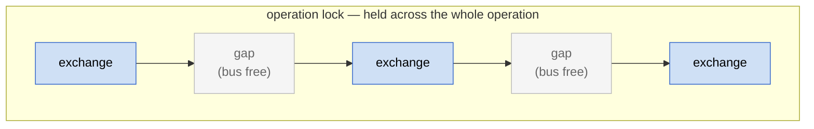

# I2C Transport

**Header:** `note/link/i2c.hpp`

## Implement `I2cHal`

`I2cHal` is the byte-conduit interface — pure hardware I/O for the
I2C bus. The library wraps your HAL in `link::I2cFramer<>`
(which adds Notecard-specific I2C framing) and then in
`Protocol` (which adds protocol-level CRC, retry, and
session semantics). Either Notecard ctor — streaming mode
(`Notecard(transport, alloc)`) or tree mode
(`Notecard(backend, transport)`) — works on the resulting stack;
both go through the unified `ITransact` interface.

```cpp
#include <note/link/i2c.hpp>

class MyI2c : public note::link::I2cHal {
public:
    // Hardware-level I2C reset. Returns false on failure.
    bool     reset()                                          override;

    // Transmit len bytes. Returns false on error (e.g. NACK).
    bool     transmit(const uint8_t* data, size_t len)        override;

    // Receive from the Notecard.
    //   len == 0  priming query: set available = pending byte count, read nothing.
    //   len  > 0  read exactly len bytes; set available = remaining byte count.
    bool     receive(uint8_t* buf, size_t len, uint32_t& available) override;

    uint32_t millis()                                         override;
    void     delay(uint32_t ms)                               override;

    // Optional: override for platforms with a larger I2C buffer.
    // Default is 30 bytes (safe for all Arduino Wire implementations).
    // STM32 / ESP32 can use up to 253 (kI2cMaxMtu).
    size_t   max_transfer()                                   override { return 253; }
};
```

Wire it up:

```cpp
MyI2c hal;
note::link::I2cFramer i2c{hal};
note::Protocol transport{i2c};

// Tree mode (response.body() works) — pass a JsonBackend.
note::backends::CjsonBackend backend;
note::Notecard nc(backend, transport);

// Or streaming mode (.into(struct), no JsonBackend needed):
// note::Notecard nc(transport, note::Allocator{});
```

## Arduino

On Arduino, `begin()` handles the full stack:

```cpp
nc.begin(Wire);                       // default pins, default address 0x17
nc.begin(Wire, 0x17);                 // explicit address
nc.begin(Wire, /*sda=*/14, /*scl=*/21);          // custom pins
nc.begin(Wire, /*sda=*/14, /*scl=*/21, 0x17);    // custom pins + address
nc.begin(Wire, note::arduino::external_bus);     // app owns Wire
```

This creates an Arduino `I2cHal` adapter internally.

### Bus management

By default, `note::arduino::I2cHal` "owns" the Wire bus — its constructor
calls `Wire.begin()` and a transient I2C error triggers `Wire.end()` /
`Wire.begin()` inside `reset()`. This is fine on devkits where Wire's
default pins are correct and nothing else shares the bus.

For non-devkit boards or shared buses, pick an alternative form of `begin`:

| Form | What the HAL does |
|---|---|
| `nc.begin(Wire)` | calls `Wire.begin()` (no pin args); `reset()` cycles `Wire.end()`/`Wire.begin()` |
| `nc.begin(Wire, sda, scl)` | calls `Wire.begin(sda, scl)`; `reset()` cycles `Wire.end()`/`Wire.begin(sda, scl)` |
| `nc.begin(Wire, note::arduino::external_bus)` | never touches the bus — app calls `Wire.begin(...)` and decides what `reset()` should do |

Use `external_bus` when the bus is shared with other drivers/tasks, or
when the app needs to set non-default Wire properties (e.g.
`setBufferSize()` on ESP32) before `begin()`. In that mode the HAL's
`reset()` is a no-op; the app is responsible for any bus-level recovery
it wants on transient I2C errors.

## Callback variant

```cpp
note::link::I2cCallbackHal hal{
    []() -> bool                                     { /* reset */    return true; },
    [](const uint8_t* d, size_t n) -> bool           { /* transmit */ return true; },
    [](uint8_t* b, size_t n, uint32_t& av) -> bool   { /* receive */  av = 0; return true; },
    []() -> uint32_t                                 { return millis(); },
    [](uint32_t ms)                                  { delay(ms); },
    // optional 6th arg: max_transfer override (default 30)
};
note::link::I2cFramer transport(hal);
```

## Protocol constants

All in `namespace note::link`:

| Constant | Value | note-c equivalent |
|---|---|---|
| `kI2cDefaultAddress` | `0x17` | `NOTE_I2C_ADDR_DEFAULT` |
| `kI2cDefaultMtu` | 30 bytes | `NOTE_I2C_MTU_DEFAULT` |
| `kI2cMaxMtu` | 253 bytes | `NOTE_I2C_MTU_MAX` |
| `kI2cIoDelayMs` | 6 ms | `_delayIO()` |
| `kI2cSegmentMaxLen` | 250 bytes | `CARD_REQUEST_I2C_SEGMENT_MAX_LEN` |
| `kI2cSegmentDelayMs` | 250 ms | `CARD_REQUEST_I2C_SEGMENT_DELAY_MS` |
| `kI2cChunkDelayMs` | 20 ms | `CARD_REQUEST_I2C_CHUNK_DELAY_MS` |
| `kI2cNackWaitMs` | 1000 ms | `CARD_REQUEST_I2C_NACK_WAIT_MS` |
| `kI2cResetDrainMs` | 500 ms | `CARD_RESET_DRAIN_MS` |
| `kI2cResetSyncRetries` | 10 | `CARD_RESET_SYNC_RETRIES` |
| `kI2cResponsePollMs` | 50 ms | poll interval in `_i2cNoteQueryLength` |
| `kI2cIntraTimeoutMs` | 1000 ms | `CARD_INTRA_TRANSACTION_TIMEOUT_SEC * 1000` |

## Protocol notes

- **6 ms IO delay** before every I2C operation (`_delayIO` in note-c) —
  empirically required for stability across commercial I2C implementations.
- Request terminated with `\n` (bare newline, not `\r\n` — some Notecard
  firmware versions don't respond to `\r\n` over I2C).
- **Priming query**: before reading a response, `receive(buf, 0, available)`
  is called to learn how many bytes the Notecard has buffered. Actual reads
  request exactly `available` bytes (capped at `max_transfer()`).
- **Chunked receive loop** exits only when `\n` has been received *and*
  `available == 0`. If the Notecard reports more bytes after the `\n`,
  they are drained first.
- **Segment pacing**: after every 250 bytes transmitted, a 250 ms pause
  is inserted to avoid overrunning the Notecard's interrupt buffers.
- **NACK handling**: a transmit failure during reset sync delays 1000 ms
  before retrying.
- CRC behavior is identical to serial (auto-detected, same sequence number
  across retries). See [CRC](transport-crc.md).

## I2C MTU

The default `max_transfer()` is 30 bytes — the limit imposed by the Arduino
Wire library's static 32-byte buffer minus the 2-byte Notecard header.
Platforms with a dynamically-allocated I2C buffer (STM32Duino, most ESP32
boards) can safely use 253. Override `max_transfer()` in your `I2cHal`
subclass or pass the size as the 6th argument to `I2cCallbackHal`.

## Sharing the bus and multi-threaded use

By default the library does no locking, and for a single-device,
single-threaded application that is exactly right: nothing else can touch the
bus or the Notecard mid-exchange, so there is nothing to guard against and the
locking machinery costs nothing.

Two different things can interfere once you leave that simple case, and the
library has two independent guards for them. You only add the one(s) that match
your situation:

| What can interfere | When it happens | The guard |
|---|---|---|
| **Another driver or master on the same bus** | The Notecard shares SDA/SCL with other chips *and* those chips can be touched **concurrently** — from an interrupt, another RTOS task, or a second bus master | **Bus lock** (`transport.set_bus_lock`) |
| **Another thread driving the same Notecard** | Two threads or tasks call the **same** `Notecard` object | **Operation lock** (`nc.set_request_lock`) |

> **Sequential sharing needs no lock.** A single `loop()` that talks to the
> Notecard and then to another chip on the same bus — one after the other — has
> no concurrency: each exchange finishes before the next begins, so nothing can
> interleave. A bus lock only earns its keep when a *second* agent (an
> interrupt, a task, another master) can drive the bus *while* a Notecard
> exchange is already in flight. Likewise the operation lock matters only when
> more than one thread shares one `Notecard`.

The two locks guard different spans of the same operation:



The **bus lock** is held only for each shaded exchange and released in the gaps,
so other bus masters get their turns. The **operation lock** is held across the
*entire* operation, gaps included, so another thread on the same Notecard cannot
slip a request into a gap. They are independent: use either, both, or neither.

### Bus lock — protect each exchange from other bus masters

Register an `IBusLock` (declared in `<note/bus_lock.hpp>`) with the transport.
The library acquires it for exactly one complete request/response exchange and
releases it between exchanges. **Every driver on the bus must share the same
lock object** — a lock only the Notecard knows about cannot serialize against a
third-party driver, so pass the same underlying mutex to your other drivers too.

Starting from the [basic stack](#implement-i2chal), adding a bus lock is three lines:

```cpp
std::mutex i2c_bus_mutex;                          // shared with every bus driver
note::LockAdapter<std::mutex> lock{i2c_bus_mutex};
transport.set_bus_lock(lock);                      // before the first request
```

Pick the adapter that matches your platform's mutex; only the lock-construction
line changes — `set_bus_lock(lock)` is the same in every case. Each adapter
holds only a reference, so the underlying mutex/semaphore must outlive the
transport.

| Adapter | For | Construct it with |
|---|---|---|
| `LockAdapter<Lockable>` | any C++ `Lockable` (`std::mutex`, `std::recursive_mutex`, …) | `note::LockAdapter<std::mutex> lock{m};` |
| `FreeRtosBusLock` | FreeRTOS / Arduino ESP-IDF | `note::FreeRtosBusLock lock{sem};` |
| `CallbackBusLock` | Zephyr, CMSIS-RTOS, bare-metal | `note::CallbackBusLock lock{acquire, release, &m};` |

**`FreeRtosBusLock`** wraps a `SemaphoreHandle_t` from `xSemaphoreCreateMutex()`.
Include `<note/arduino/freertos_bus_lock.hpp>` on FreeRTOS targets only — it
pulls in FreeRTOS headers and must not be compiled on host builds:

```cpp
SemaphoreHandle_t i2c_mutex = xSemaphoreCreateMutex();  // share with every task
note::FreeRtosBusLock lock{i2c_mutex};
transport.set_bus_lock(lock);
```

**`CallbackBusLock`** bridges any mutex API with a C callback surface. It takes
an acquire callback, a release callback, and a context pointer (either callback
may be null for a no-op, though normally you provide both):

```cpp
note::CallbackBusLock lock{
    [](void* ctx) { MyRtos_MutexAcquire(static_cast<MyRtosMutex*>(ctx)); },
    [](void* ctx) { MyRtos_MutexRelease(static_cast<MyRtosMutex*>(ctx)); },
    &i2c_mutex
};
transport.set_bus_lock(lock);
```

#### On the Arduino convenience wrapper

The `note::arduino::Notecard` type (`nc.begin(Wire)`) builds its `Protocol`
internally and does not expose `set_bus_lock`. To share a bus lock on Arduino,
build the stack explicitly with the core `note::Notecard` instead. Construct the
HAL with `external_bus` so it leaves `Wire.begin()`/`Wire.end()` to you, and use
`FreeRtosBusLock` (shared-bus concurrency on Arduino almost always means an RTOS
target such as ESP32 — a single-threaded AVR sketch needs no lock):

```cpp
Wire.begin(sda, scl);                              // app owns the bus

note::arduino::I2cHal hal{Wire, note::arduino::external_bus};
note::link::I2cFramer<> i2c{hal};
note::Protocol transport{i2c};

SemaphoreHandle_t i2c_bus_mutex = xSemaphoreCreateMutex();
note::FreeRtosBusLock lock{i2c_bus_mutex};
transport.set_bus_lock(lock);

note::backends::StaticJsonBackend<512, 64> backend;
note::Notecard nc{backend, transport};
```

### Operation lock — make a whole operation atomic from other threads

The bus lock guards a single exchange. Some Notecard operations are *several*
exchanges — a binary transfer is a command, then the payload, then a verify —
and a request group you build yourself may be several more. If two threads share
one `Notecard`, the bus lock alone would let the second thread's request land in
a gap between the first thread's exchanges. The **operation lock** closes that
gap: it is held across the whole operation, so one thread's multi-step operation
completes before another thread's begins. (This is a property of the `Notecard`,
not the I2C transport — it applies to the serial transport too.)

Register it with `set_request_lock`. **The operation lock must be recursive**
(`std::recursive_mutex` or a recursive RTOS mutex): the library re-enters itself
on the same thread — `execute()` is called from inside a binary transfer, for
example — and a non-recursive lock would deadlock. It is a *different* lock from
the bus lock, which need not be recursive:

```cpp
std::recursive_mutex nc_mutex;                     // per-Notecard, recursive
note::LockAdapter<std::recursive_mutex> op_lock{nc_mutex};
nc.set_request_lock(op_lock);
```

With the operation lock set, **binary transfers are atomic out of the box** —
`card.binary.put`/`get` open the operation scope internally, so their
command → payload → verify sequence is never interleaved by another thread, and
the payload stream additionally holds the bus lock continuously (no other master
can break into the COBS stream). You do not have to wrap binary transfers in
anything.

### Grouping requests: `exclusive()` and `keep_ready()`

The operation lock makes each *single* operation atomic. To make a group of
*independent* requests atomic — read a value, decide, then write it back, with
no other thread acting on the Notecard in between — open an `exclusive()`
session. It holds the operation lock for the lifetime of the returned guard:

```cpp
{
    auto session = nc.exclusive();   // operation lock held for this scope
    auto cfg = nc.execute(read_req);
    // ... no other thread can touch nc here ...
    nc.execute(write_req);
}                                    // lock released here
```

`exclusive()` is exclusion only. On SKUs with RTX/CTX transaction pins you can
*also* hold the Notecard **ready** across the group with `keep_ready()`, so it
cannot drop into low-power sleep mid-group (see [readiness](#readiness-rtxctx-pins)
below). The two are independent — declare `exclusive()` **first** so the lock is
held before the readiness scope opens:

```cpp
auto ex = nc.exclusive();    // 1. acquire the operation lock
auto kr = nc.keep_ready();   // 2. then hold the Notecard ready
```

On a multi-threaded Notecard, `keep_ready()` must be paired with `exclusive()`
in that order; using it alone, or before `exclusive()`, races on the shared
readiness state. Single-threaded use needs neither.

### Readiness (RTX/CTX pins)

Some Notecard SKUs expose RTX/CTX handshake pins that let the host signal "I am
about to transact, stay awake" and wait for the Notecard to confirm it is ready,
so the card does not sleep between the steps of an operation. This is **readiness
signaling**, separate from both locks. Attach a `TxnHandshake` to the transport,
and the library asserts readiness once per operation:

```cpp
transport.set_handshake(handshake);   // your TxnHandshake, bound to the pins
```

Readiness is compiled in only when `NOTE_TXN_HANDSHAKE` is enabled; with it off,
`set_handshake` and `keep_ready()` are no-ops with no code cost.

### Zero cost on constrained devices

On AVR and other single-threaded platforms no lock is registered and no
lock-related code runs. The compile-time `NullLock` type provides an empty
`lock()`/`unlock()` with no vtable; the template-specialised (static) path uses
it via empty-base optimization and contributes zero bytes to the final binary.

To remove the bus-lock hook entirely from the default vtable-dispatched
transport (saving one pointer and one null check per exchange), set
`NOTE_I2C_BUS_LOCK=0` — or use `NOTE_MINIMAL`, which sets it to `0`
automatically.
