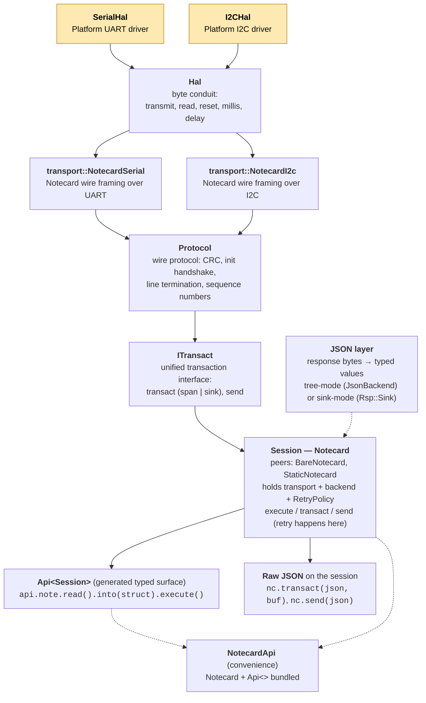

# Transport

`note-cpp` ships a complete, header-only implementation of both Notecard
Serial and I2C wire protocols, with the timing, CRC and framing that Notecard expects (equivalent to
note-c) using no global state and no cJSON dependency.

## Architecture

The library uses a layered architecture — each layer has one job, and the layer above sees
only its predecessor's interface. Reading from the bottom up, the layers are:

1. **`Hal`** — platform byte conduit. `transmit`, `read`, `reset`, `millis`, `delay`,
   `write_line_terminator`. No protocol logic; just moves bytes. You implement this
   for your platform (or extend `arduino::SerialHal` / `arduino::I2CHal`).
2. **`transport::NotecardSerial<Policy>` / `transport::NotecardI2c<Policy>`** — Notecard
   wire framing over a byte `Hal`. Handles segment pacing, chunking, drain/reset windows,
   and I2C MTU negotiation. Owns the `ProtocolPolicy` — wire-level timing fields
   (`segment_*`, `intra_timeout_ms`, `reset_*`); runtime-mutable or compile-time
   `[[no_unique_address]]`. These are themselves `Hal`s — the layer above sees a
   framing-aware byte conduit.
3. **`Protocol`** — full Notecard wire protocol over a framing `Hal`: CRC validation,
   init handshake, line termination, sequence numbers. The only concrete protocol
   driver. No retry — retry lives at the session layer.
4. **`ITransact`** — unified Notecard transaction interface. Three operations:
   `transact(req, span)` → `string_view`, `transact(req, sink)` → SAX events,
   and `send(req)` (fire-and-forget). Buffered vs streaming are *response
   presentations* (overloads), not sibling transports. `Protocol` implements
   `ITransact` natively. This is the contract a session class holds; the
   session itself is layer 6.
5. **JSON layer** — turns response bytes into typed values. Tree mode (`JsonBackend`
   walks a parsed tree) or sink mode (SAX events fire into `Rsp::Sink`). See
   "JSON layer — the actual buffered/streaming choice" below.
6. **Session — `Notecard` (or peer: `BareNotecard`, `StaticNotecard`)** — runtime
   object holding an `ITransact&`, an optional `JsonBackend&`, a `RetryPolicy`,
   and inter-transaction timing. Exposes `transact(json, buf)`, `send(json)`,
   `execute(req)`. Retry happens here, gated by per-request `Safety`. The three
   session classes are *peers* (alternative entry points), not stacked — pick one;
   each carries its own retry, so there's no retry-of-retry by construction.
7. **`Api<Session>`** — generated typed surface
   (`api.note.read().into(struct).execute()`, `api.card.attn.arm().execute()`).
   Each builder's `.execute()` dispatches to the bound session's `execute(req)` —
   so typed and raw paths share one retry/transport pipeline.
8. **`NotecardApi` (convenience bundle)** — single object bundling a default
   `Notecard` + `Api<>` so callers don't have to construct both. The 99% case.

### Approximate OSI mapping

The library's layer structure maps roughly onto the OSI 7-layer model. Useful as a mental model for readers familiar with networking; not a strict claim.

| OSI layer | Concept | note-cpp type |
|---|---|---|
| 1+2 (physical / link) | byte conduit | `note::Hal` (and platform impls: `arduino::SerialHal`, `arduino::I2CHal`, `posix::*Hal`) |
| 2 (data link) | Notecard wire framing — segment pacing, MTU, drain windows | `note::transport::NotecardSerial<>`, `note::transport::NotecardI2c<>` |
| 2 (link config) | wire pacing policy | `note::transport::ProtocolPolicy` (+ `SerialPolicy` / `I2cPolicy`) |
| 4-ish (link reliability) | CRC, retry, init handshake, line termination, sequence numbers | `note::Protocol` |
| 5 (session contract) | unified transact/send interface | `note::ITransact` |
| 5+ (session implementation) | session class | `note::Notecard` (+ peers `BareNotecard`, `StaticNotecard`) |
| 6 (presentation) | bytes ↔ typed values | `JsonBackend`, `JsonReader`, `JsonBuilder`, `JsonSink` |
| 7 (application) | typed builders / convenience bundle | `Api<>`, `NotecardApi` |

Layer 4 is "ish" because Notecard is single-link with no routing — `Protocol` is really upper-link reliability rather than true OSI-Transport. The mapping is approximate, but the *discipline* of "one concept per layer, layers don't overlap" is the design principle the codebase aims for.



The shaded boxes are what you implement (one of `SerialHal` or `I2CHal`,
typically by extending the Arduino-flavored variant). Everything above
`Hal` is library code.

**You implement**: `SerialHal` (4 methods) or `I2CHal` (5 methods) — pure
hardware I/O, no protocol logic.

**The library provides**: protocol framing, CRC, retry, JSON streaming,
COBS binary transfer — all built on your HAL.

### Headers

```
include/note/
    transport_hal.hpp          Hal (pure HAL interface)
    transport.hpp              ITransact (unified session interface)
    protocol.hpp               Protocol (concrete wire-protocol driver)

include/note/transport/
    serial.hpp             SerialHal, SerialCallbackHal, NotecardSerial
    i2c.hpp                I2CHal,    I2cCallbackHal,    NotecardI2c
    protocol_policy.hpp    ProtocolPolicy, SerialPolicy, I2cPolicy (+ Static* variants)
    detail/crc32.hpp       CRC32, crc_add, crc_check_and_strip
```

> **Naming note.** `IBufferedTransport` (the transitional bridge class)
> has been dropped. `ITransact` carries default impls for the
> `RequestSource` overloads that materialise into a stack scratch buffer
> and forward to the buffered `transact(req, span, t)` virtual, so
> transports that only support pre-built strings inherit the bridges
> automatically — derive from `ITransact` directly and override the
> string_view-shaped virtuals.

## Transport-agnostic API

Both layers above `Notecard` are transport-agnostic. The same call
yields equivalent results regardless of which transport the Notecard
was constructed against:

- **Typed API** (`api.note.read().into(struct).execute()`,
  `api.note.update(file, id).body(struct).execute()`).
- **Raw JSON API** (`nc.transact(json, buf)`, `nc.send(json)`).

> Contributor Note: This is pinned in CI by `tests/test_transport_agnostic_api.cpp`, which pairs four call-site categories against both Notecard ctors:

| § | Surface | Streaming | Buffered |
|---|---|:---:|:---:|
| 1 | `api.note.read().into(struct).execute()` | ✓ | ✓ |
| 2 | `api.note.update(file, id).body(struct).execute()` | ✓ | ✓ |
| 3 | `nc.transact(json, buf)` | ✓ | ✓ |
| 4 | `nc.send(json)` | ✓ | ✓ |

If the high-level surface ever drifts apart between transports, one of
those four pairs goes red.

## JSON layer — the actual buffered/streaming choice

What people often call "buffered transport" vs "streaming transport"
isn't really about *transport* — those terms describe the **JSON
layer**: the strategy `Notecard` runs internally to turn response
bytes into typed values (when using the typed API), or for generating or parsing the JSON data directly in the application.

| Mode | How it parses | Enables | Memory profile |
|------|---|---|---|
| **Tree mode** | `JsonReader` walks a parsed tree | `response.body()` returns `JsonReader*` for ad-hoc walking | Builds a tree (jsmn tokens or cJSON nodes) sized to the response |
| **Sink mode** | SAX events fire into `Rsp::Sink` | `.into(T&)` populates user struct directly | Zero intermediate tree |

Both modes populate the typed `Response` struct identically. The
mode is selected by *which `Notecard` ctor* you use:

```cpp
// Tree mode — JsonBackend supplied → response.body() works.
note::backends::BufferJsonBackend<512, 64> backend;
note::Notecard nc(backend, transport);

// Sink mode — no JsonBackend → smaller flash, .into(struct) for body.
note::Notecard nc(transport, note::Allocator{});
```

`.into(T&)` works in both modes (transport-agnostic, see § 1 above).
`response.body()` is tree-mode only — sink-mode has no tree to walk.

### Mode selection guide

Pick **tree mode** when:
- You're migrating from note-c — the `request()` lambda builder matches
  the familiar "build JSON, send, parse" pattern.
- You need ad-hoc JSON walking via `JsonReader`.
- You're debugging wire traffic and want a tree to inspect.

Pick **sink mode** when:
- You're on a memory-constrained target — no tree, no JsonBackend
  pulled in, smaller flash.
- All your body shapes are known statically (use `.into(T&)`).
- You don't need `response.body()` for any endpoint.

### Comparison

| Feature | Tree mode | Sink mode |
|---------|:---------:|:---------:|
| Typed `execute()` on requests | yes | yes |
| Typed response fields | yes | yes |
| `.into(T&)` body parse into struct | yes | yes |
| `.body(T&)` send struct as body | yes | yes |
| `nc.transact(json, buf)` raw JSON | yes | yes |
| Binary transfers (COBS) | yes | yes |
| Error handling (`ApiResult`) | yes | yes |
| `request()` lambda builder | yes | — |
| `response.body() -> JsonReader*` | yes | — |
| Requires `JsonBackend` | yes | no |
| Zero-heap capable | depends on backend | yes |

Define `NOTE_NO_BUFFERED` to remove tree mode entirely (~2-4 KB flash
savings). Set automatically by `NOTE_MINIMAL`.

### JSON backend selection (tree mode only)

| Backend | Heap | Best for |
|---------|:----:|----------|
| `CjsonBackend` | yes | Migration from note-c |
| `NlohmannBackend` | yes | Projects already using nlohmann/json |
| `BufferJsonBackend<N, M>` | no | Fixed-size buffer, no heap |
| `CjsonArenaBackend` | no (arena) | Tree debuggability + bounded memory |

See [JSON backend](json-backend.md) for configuration details.

## Transport guides

| Guide | Covers |
|-------|--------|
| [Serial transport](transport-serial.md) | `SerialHal`, Arduino setup, protocol constants, binary streaming |
| [I2C transport](transport-i2c.md) | `I2CHal`, MTU negotiation, priming query, Arduino setup |
| [CRC](transport-crc.md) | Auto-detection, wire format, streaming vs buffered implementation |
| [Binary transfer](binary-transfer.md) | `card.binary` put/get, COBS, MD5 verification |
| [JSONB wire format](jsonb.md) | Compact binary encoding (alternative to JSON text) |

## Arduino shorthand

On Arduino, `note::arduino::Notecard` wraps the full stack behind
`begin()`. Sink mode by default; pass a `JsonBackend&` to opt into
tree mode:

```cpp
#include <note.hpp>

note::arduino::Notecard nc;

void setup() {
    nc.begin(Serial1, 9600);                // sink mode, serial
    // or: nc.begin(Wire);                   // sink mode, I2C
    // or: nc.begin(Wire, 0x17);             // sink mode, I2C with custom address
    // or: nc.begin(Serial1, 9600, backend); // tree mode (response.body() works)
    // or: nc.begin(Wire, backend);          // tree mode, I2C
}
```

The buffered begin overloads no longer take a separate `rsp_buf`
argument — the Notecard owns a default response staging buffer
(`NOTE_RSP_BUF_SIZE`, default 1024 bytes). Call
`nc.set_response_buffer(span)` after `begin()` if you need a
non-default size.

See the [Arduino guide](platforms/arduino/guide.md) for full setup
details.

## Retry

Retry is handled by the `Notecard` layer, not the transport. Each
request carries a `Safety` level (`ReadOnly`, `Idempotent`,
`NonIdempotent`, `Destructive`) that gates retry behaviour:

- `SendFailed` — always retried (request never reached the Notecard).
- `ResponseLost` — retried only for `ReadOnly` and `Idempotent`
  requests.
- Notecard errors — never retried.

See [retry design](internal/retry-design.md) for the full safety
matrix and importance levels.
