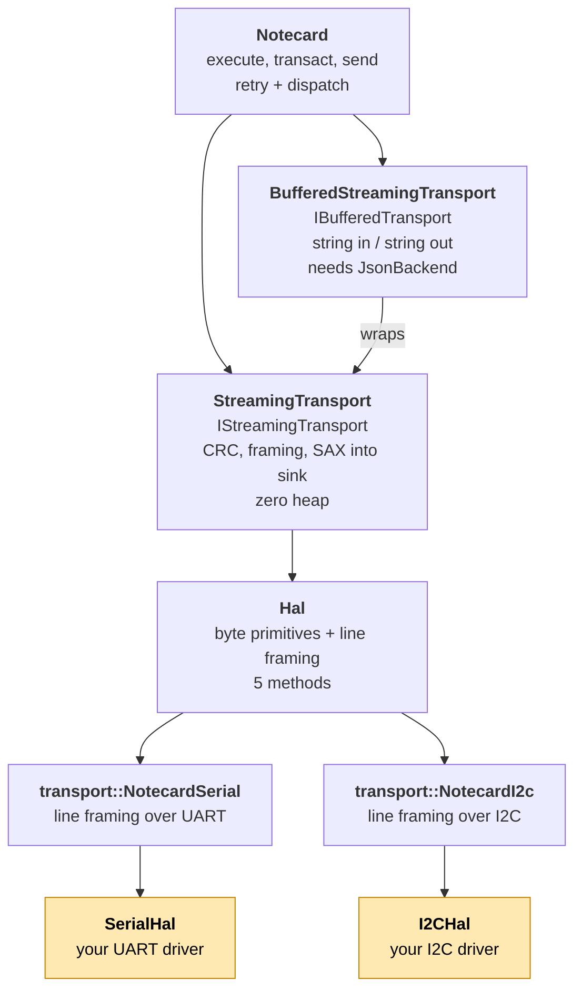

# Transport

`note-cpp` ships a complete, header-only implementation of both Notecard
wire protocols. These are a direct alternative to note-c's serial and I2C
transports — same timing, same CRC, no global state, no cJSON dependency.

## Architecture

The streaming/buffered axis (response presentation) is independent of the
serial/I2C axis (bus). Either transport drives either bus through the
shared `Hal` interface.



The shaded boxes are what you implement (one of `SerialHal` or `I2CHal`,
typically by extending the Arduino-flavored variant). Everything above
`Hal` is library code; the axes are orthogonal so any
streaming/buffered × serial/I2C combination is valid.

**You implement**: `SerialHal` (4 methods) or `I2CHal` (5 methods) — pure
hardware I/O, no protocol logic.

**The library provides**: protocol framing, CRC, retry, JSON streaming,
COBS binary transfer — all built on your HAL.

### Headers

```
include/note/
    transport_hal.hpp          Hal (pure HAL interface)
    streaming_transport.hpp    IStreamingTransport, StreamingTransport
    transport.hpp              IBufferedTransport, AbstractTransport

include/note/transport/
    serial.hpp          SerialHal, SerialCallbackHal, NotecardSerial
    i2c.hpp             I2CHal,    I2cCallbackHal,    NotecardI2c
    detail/crc32.hpp    CRC32, crc_add, crc_check_and_strip
```

## Streaming vs buffered

Two internal paths for building requests and parsing responses. The typed
API works identically on both — you don't change application code when
switching.

### Streaming (default, recommended)

Requests serialize directly to the wire. Responses are SAX-parsed as bytes
arrive. No intermediate buffer, no heap allocation.

```cpp
// Your hardware
MySerial hal;
note::transport::NotecardSerial serial_hal(hal);
note::StreamingTransport transport(serial_hal);

// Zero heap — arena allocator for string interning
char pool[256];
note::MonotonicArena arena(pool);
note::Notecard nc(transport, note::arena_allocator(arena));
```

### Buffered

Requests are built into a string buffer. Responses are parsed into a JSON
tree via a [JSON backend](json-backend.md). A raw string interface
(`transact()`) is also available.

```cpp
note::backends::BufferJsonBackend<512, 64> backend;
MyI2cTransport transport;  // IBufferedTransport
note::Notecard nc(backend, transport);
```

Use the buffered path when:
- **Migrating from note-c** — the `request()` lambda builder matches the
  familiar "build JSON, send, parse" pattern
- **Manual JSON tree inspection** — `JsonReader` gives tree-style access
  to unknown/dynamic response structures
- **Debugging** — the intermediate JSON string is visible in debuggers

### Comparison

| Feature | Streaming | Buffered |
|---------|:---------:|:--------:|
| Typed `execute()` on requests | yes | yes |
| Typed response fields | yes | yes |
| Body structs (`.body()`, `.into()`) | yes | yes |
| Binary transfers (COBS) | yes | yes |
| Error handling (`ApiResult`) | yes | yes |
| `request()` lambda builder | — | yes |
| `JsonReader` tree access | — | yes |
| Requires `JsonBackend` | no | yes |
| Zero-heap capable | yes | no |

Define `NOTE_NO_BUFFERED` to remove the buffered path entirely (~2–4 KB
flash savings). Set automatically by `NOTE_MINIMAL`.

### JSON backend selection (buffered only)

| Backend | Heap | Best for |
|---------|:----:|----------|
| `CjsonBackend` | yes | Migration from note-c |
| `NlohmannBackend` | yes | Projects already using nlohmann/json |
| `BufferJsonBackend<N, M>` | no | Fixed-size buffer, no heap |

See [JSON backend](json-backend.md) for configuration details.

## Transport guides

| Guide | Covers |
|-------|--------|
| [Serial transport](transport-serial.md) | `SerialHal`, Arduino setup, protocol constants, binary streaming |
| [I2C transport](transport-i2c.md) | `I2CHal`, MTU negotiation, priming query, Arduino setup |
| [CRC](transport-crc.md) | Auto-detection, wire format, streaming vs buffered implementation |
| [Binary transfer](binary-transfer.md) | `card.binary` put/get, COBS, MD5 verification |
| [JSONB wire format](jsonb.md) | Compact binary encoding (alternative to JSON text) |

## Arduino shorthand

On Arduino, `note::arduino::Notecard` wraps the full stack behind `begin()`:

```cpp
#include <note.hpp>

Notecard nc;

void setup() {
    nc.begin(Serial1, 9600);    // serial — streaming path
    // or: nc.begin(Wire);      // I2C — buffered path (default address 0x17)
    // or: nc.begin(Wire, 0x17, allocator);  // explicit
}
```

See the [Arduino guide](platforms/arduino/guide.md) for full setup details.

## Retry

Retry is handled by the `Notecard` layer, not the transport. Each request
carries a `Safety` level (`ReadOnly`, `Idempotent`, `NonIdempotent`,
`Destructive`) that gates retry behavior:

- `SendFailed` — always retried (request never reached the Notecard)
- `ResponseLost` — retried only for `ReadOnly` and `Idempotent` requests
- Notecard errors — never retried

See [retry design](internal/retry-design.md) for the full safety matrix
and importance levels.
