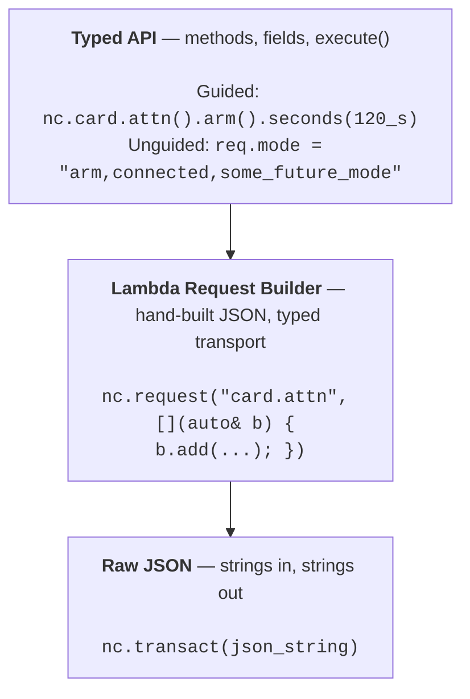

# Using the API

`note-cpp` wraps the Notecard's JSON-over-wire API in typed C++ — autocomplete-friendly operations, several calling styles for different C++ standards, and an escape hatch for raw JSON when you need it. This page walks the layers and styles so you can pick what fits.

> Throughout this page, `nc` is the `Notecard` instance. On Arduino it is also the API surface (`nc.hub.set()` works directly). On stdcpp you wrap explicitly — `Notecard nc(backend, transport); Api api(nc);` — and `api.hub.set()` is equivalent. Either style appears in `note-cpp` code in the wild; pick the one that matches your platform.

## A taster

A request, the wire bytes it produces, and the response — start to finish:

```cpp
auto r = nc.card.version().execute();
if (r) {
    // r.version is the firmware version string
    // r.device  is the device DID
}
```

That call sends this JSON to the Notecard:

```json
{"req":"card.version"}
```

The Notecard answers in kind:

```json
{"version":"notecard-1.5.4...","device":"dev:864475044211711","sku":"NOTE-WBNA","board":"3.2.1","api":4,...}
```

`note-cpp` parses that into the `r` struct — each field is typed and tracks whether the Notecard sent it. Building a request follows the same shape: chain typed setters and call `execute()`. For example, `nc.hub.set().product("com.example.app").mode("periodic").execute()` produces `{"req":"hub.set","product":"com.example.app","mode":"periodic"}`. See [working-with-responses.md](working-with-responses.md) for the full response model (presence checks, body parsing, errors).

The rest of this page explains why there are layers underneath this one call — and when you'd reach for them.

## The three layers

`note-cpp` is built as three layers. The **typed API** is what most developers use — methods, fields, and `execute()`. No templates, no lambdas, no JSON keys to remember. Beneath it, the **lambda request builder** lets you hand-build JSON with the same retry and transport behavior. At the bottom, **raw JSON** is strings in and strings out. Each lower layer trades a little ergonomics for a little flexibility, and all three share the same transport — they can mix freely in the same firmware. Use the outermost layer that fits.



### Typed API

The typed API is the primary interface and the one most developers should use exclusively. There are no templates, no angle brackets, and no lambdas — just methods, fields, and `execute()`. The API mirrors the Notecard's JSON structure using plain C++ naming, so if you know the Notecard API, you already know how to use it.

#### Guided requests

Many Notecard endpoints do different things depending on which fields you send. The typed API splits these into named **operations** so that each call only exposes the fields that apply to that behavior:

```cpp
// Arm ATTN for file changes with 2-minute timeout
nc.card.attn().arm()
    .files()
    .connected()
    .seconds(120_s)
    .execute();

// Query what triggered ATTN
auto q = nc.card.attn().query().execute();

// Read temperature
auto r = nc.card.temp().read().execute();
if (r) Serial.println(r.value);
```

Setting a field that doesn't belong is a compile error rather than a runtime surprise. Each operation also carries a retry-safety classification (`ReadOnly`, `Idempotent`, `NonIdempotent`, `Destructive`) that the library uses automatically.

This is the pattern the consolidated guide returns to throughout — see [§ Focused operations](#focused-operations-on-multi-purpose-endpoints) for the full design.

#### Unguided requests

Focused operations are built on top of typed request structs — they pre-set the fields needed for the call being performed and only expose the relevant surface. The underlying general request type has all fields. You can access it directly when you need a field combination the library doesn't guide you towards:

```cpp
// The typed API doesn't know about "some_future_mode" yet,
// but the full request type lets you pass any string:
note::api::CardAttn::Request req;
req.mode = "arm,connected,some_future_mode";
req.seconds = 120;
nc.execute(req);
```

There are still no lambdas and no templates — just struct field assignment. You get the same typed response and the same retry behavior. What you lose is the library's guidance: all fields are visible, and it is up to you to pick the right combination. The Notecard still validates at runtime.

Use unguided requests when:

- New Notecard firmware adds something the typed API does not model yet.
- You need a field combination that spans multiple operations.
- You are prototyping and want to iterate quickly on field combinations.

For fields that are not in the schema at all, the **extras** mechanism (`operator[]`) lets you set arbitrary key-value pairs on any request. See [§ Calling styles](#calling-styles-within-the-typed-layer) below for the calling-style options and the ad-hoc-field syntax.

### Lambda request builder

The lambda request builder is the first layer where lambdas appear. It targets advanced cases like migrating custom JSON structures from existing code, where declaring struct types for one-off custom note bodies is more work than it's worth.

The lambda builder lets you build JSON by hand without any generated types. This is useful for entirely new request types or as a familiar entry point for developers migrating from `note-c`, where all requests are hand-built JSON. The typed API itself uses lambda builders internally to construct requests and parse responses.

```cpp
// Ad-hoc request with manual JSON building
auto result = nc.request("card.attn", [](note::JsonBuilder& b) {
    b.add("mode", "arm,connected");
    b.add("seconds", 120);
});
if (result) {
    auto& reader = result.reader();
    bool set = reader.get_bool("set");
}

// Fire-and-forget (sends "cmd" instead of "req")
nc.command("hub.sync");
```

There is no type safety on either end — you build the request and parse the response manually. This provides maximum flexibility with minimum guardrails. See the [getting started example](../examples/stdcpp/getting-started.cpp) (section 1, "Ad-hoc requests") for building requests and reading response fields by name, and the [sending notes example](../examples/stdcpp/sending-notes/) for building and parsing custom bodies.

#### Migration from note-c

If you are coming from `note-c` or `note-arduino`, the lambda request builder is the easiest starting point. Your existing mental model of "build a JSON request, send it, parse the response" maps directly:

```cpp
// note-c:
J* req = NoteNewRequest("hub.set");
JAddStringToObject(req, "product", "com.example.app");
JAddStringToObject(req, "mode", "periodic");
NoteRequest(req);

// note-cpp lambda request builder — same structure, different syntax:
nc.request("hub.set", [](note::JsonBuilder& b) {
    b.add("product", "com.example.app");
    b.add("mode", "periodic");
});

// or use the typed API:
nc.hub.set().product("com.example.app").mode("periodic").execute();
```

You can migrate one request at a time. All styles coexist in the same firmware, sharing the same serial or I²C connection.

### Raw JSON

Raw JSON is the lowest level — raw strings in, raw strings out. It is intended for protocol-level work and highly constrained environments.

Pass a pre-built JSON string directly to the Notecard. The response comes back as a string you parse yourself.

```cpp
// Caller-owned buffer for the response
char buf[256];
auto rsp = nc.transact(R"({"req":"card.version"})", buf);
if (rsp) {
    // *rsp is a string_view into buf containing the JSON response
}

// Heap-allocated (OwnedBuffer, freed on scope exit)
auto rsp = nc.transact(R"({"req":"card.version"})");
```

To extract fields from a raw response without pulling in the SAX parser, pair `transact_raw` with `note::JsonView` — substring lookups against the buffered response. This skips ~8 KB of flash on AVR compared to `transact_dispatch` plus a `JsonSink`:

```cpp
#include <note/json_view.hpp>

char buf[128];
auto body = note::JsonView(
    nc.stack().transport.transact_raw(req.view(), buf, sizeof(buf), 10000)
).object("body");

float temp   = body.get_float("temp");
int32_t hum  = body.get_int  ("humidity");
```

See the [Arduino guide](platforms/arduino/guide.md#binary-size-comparison) for the full flash/RAM comparison between the SAX-sink and `JsonView` scan approaches.

For requests with runtime values, `JsonBuf` builds the JSON into a fixed-size buffer with no heap allocation:

```cpp
float temperature = read_sensor();

note::JsonBuf<128> req;
req.add("req", "note.add");
req.add("file", "sensors.qo");
req.begin_object("body");
    req.add("temp", temperature);   // runtime value
    req.add("humidity", read_rh()); // runtime value
req.end_object();
req.close();

char buf[256];
auto rsp = nc.transact(req.view(), buf);
```

See [JSON Buffer Builder](json-builder.md) for the full `JsonBuf` API, including compile-time JSON construction.

This is the thinnest possible wrapper — JSON envelope validation, retry, and transport abstraction, and that is about it. Use it for protocol-level debugging, or when sending and parsing requests in a highly constrained environment where even the lambda builder overhead is too much.

### Choosing a layer

| Layer | Complexity | Use when | You lose | AVR flash (vs typed) |
|-------|-----------|----------|----------|---------------------|
| **Typed API** (guided) | Methods and fields | Normal development | Nothing — this is the default | baseline (~24.7 KB) |
| **Typed API** (unguided) | Structs and fields | New request fields and values, cross-operation fields | Focused field surface | −210 B |
| **Lambda Request Builder** | Lambdas and strings | Unknown endpoints, migration from note-c | Most type safety | similar to typed |
| **Raw JSON + SAX sink** | Raw strings + custom `JsonSink` | Need streaming response parse (low response RAM) | Typed response fields | **−4.2 KB** |
| **Raw JSON + `JsonView` scan** | Raw strings + substring lookup | Known response shapes; flash is the bottleneck | Robust JSON parsing | **−13.8 KB** |

We recommend starting with the typed API and dropping down only when you have a reason. Most firmware will never need anything beyond the guided typed API. Full flash/RAM comparison table in the [Arduino guide](platforms/arduino/guide.md#binary-size-comparison).

## Calling styles within the typed layer

The typed API accepts the same request five different ways. Pick the one that matches your C++ standard and house style — they all compile to the same code, none is "more advanced" than another. Most projects settle on one or two and stay there.

| Style | C++17 | C++20 | Best for |
|---|---|---|---|
| Fluent builder | ✓ | ✓ | One-shot calls, chained setters reading top-to-bottom |
| Positional shorthand | ✓ | ✓ | One-liners with one or two common fields |
| Designated initializers | — | ✓ | Named-field syntax, locally-scoped struct construction |
| Args struct (nested braces) | ✓ | ✓ | C++17 equivalent of designated init |
| Direct struct construction | ✓ | ✓ | When you have a request struct from elsewhere |

C++20 also adds `consteval` validation for enum fields like `mode` — passing an invalid string is a compile error on C++20, runtime error on C++17. Other than that, the surface is the same. See [§ Setting the C++ standard](#setting-the-c-standard) below for build flags per platform.

### Fluent builder

Every endpoint is a builder with typed setters that chain:

```cpp
auto result = nc.hub.set()
    .mode("periodic")
    .product("com.example.app")
    .outbound(60_mins)
    .execute();
```

Each setter returns a reference to the builder, so calls chain naturally. `execute()` sends the request and returns a typed `ApiResult<Response>`.

### Positional shorthand

Aliases accept the most common arguments as positional parameters:

```cpp
nc.note.read("data.qi");                 // file
nc.note.remove("data.db", "my-note");    // file, noteId
nc.env.setDefault("name", "value");      // name, text
nc.file.remove("old.db");                // files (single)
```

These return the same builder — you can chain further:

```cpp
nc.note.read("data.qi").noteId("specific-note").execute();
```

### Designated initializers (C++20)

Aliases accept an args struct with named fields:

```cpp
nc.note.read({.file = "data.qi"}).execute();
nc.env.setDefault({.name = "var", .text = "value"}).execute();
nc.file.remove({.files = {"a.db", "b.db"}}).execute();
```

The `Args` structs (`ReadArgs`, `RemoveArgs`, etc.) mirror the builder's field types. Array fields use `ArrayField`, so initializer-list syntax works naturally inside the designator.

### Args struct (C++17)

The same args struct works without designated initializers using nested braces:

```cpp
// Single field — outer braces for the struct, value inside:
nc.note.read({"data.qi"}).execute();

// Multiple fields — positional order matches struct declaration:
nc.note.remove({"data.db", "my-note"}).execute();

// Array field — nested braces for the initializer list:
nc.file.remove({{"a.db", "b.db"}}).execute();
```

### Direct struct construction

For `nc.execute()` with a fully constructed request:

```cpp
// C++20 designated init:
nc.execute(note::api::EnvSet{.name = "temp", .text = "22.5"});

// C++17:
note::api::EnvSet req;
req.name = "temp";
req.text = "22.5";
nc.execute(req);
```

This is what to reach for when you have a request struct from elsewhere — built by a function, returned from a config object, or assembled across several lines.

### Ad-hoc fields (`operator[]`)

Every request supports `operator[]` for setting fields by their JSON wire name. For known fields, the value is routed to the typed field. For unknown fields, the value is stored in an extras buffer and serialized alongside the typed fields.

```cpp
auto req = nc.hub.set();

// Known field — routes to the typed setter (same as req.product = "...")
req["product"] = "com.example.app";

// Unknown field — stored in extras, sent on the wire as-is
req["some_new_field"] = "value";
req["retry_count"] = int32_t(3);

req.execute();
```

This is useful when new Notecard firmware adds fields the typed API does not model yet, or for one-off experimentation. Supported value types are `bool`, `int32_t`, `double`, and `string_view`.

The extras buffer holds up to 4 ad-hoc fields by default. Override `NOTE_EXTRAS_MAX` before including any `note/api` headers to change the limit. Define `NOTE_EXTRAS=0` to disable extras entirely and save flash. See [Feature Flags](feature-flags.md) for details.

> **Note:** `operator[]` is available on requests only, not on responses. Response fields are always accessed via the typed struct members. To read response fields by name, drop down to the [§ Lambda request builder](#lambda-request-builder) and parse the response via `JsonReader`:
>
> ```cpp
> auto result = nc.request("card.version");
> if (result) {
>     auto& reader = *result.value();
>     auto version = reader.get_string("version");
>     auto some_new_field = reader.get_int("some_new_field");
> }
> ```

### Array fields

Some request fields accept multiple values (e.g. `file.delete` takes a list of filenames). These support several initialization styles:

```cpp
auto req = nc.file.remove();

// Initializer list — most natural for literals:
req.files = {"data.qi", "settings.db"};

// Single value — clears and sets one element:
req.files = "data.qi";

// Chained add():
req.files.add("data.qi").add("settings.db");

// Callable with initializer list:
req.files({"data.qi", "settings.db"});
```

All produce the same wire format: `"files":["data.qi","settings.db"]`.

Single-value assignment (`req.files = "data.qi"`) replaces the array contents. Use `add()` to append.

### Responses

Responses are typed structs with fields that match the Notecard's JSON output:

```cpp
auto rsp = nc.card.version().execute();
if (rsp) {
    auto ver = rsp.version;      // string_view
    auto body = rsp.body;        // BodyValue (nested JSON)
}

auto rsp = nc.card.temp().read().execute();
if (rsp) {
    float temp = rsp.value;      // temperature in °C
}
```

`.read()` selects the Read operation — `card.temp` is polymorphic (`Read`, `Configure`, `Stop`). On error, `rsp` is falsy and `rsp.error()` returns the `ErrorInfo`. See [working-with-responses.md](working-with-responses.md) for the full response model — presence checks, body parsing, error categories.

### Setting the C++ standard

The library requires C++17 or later. C++20 unlocks designated initializers, duck-typed args structs, and `consteval` enum validation; the rest of the surface is the same.

#### PlatformIO (Arduino framework)

```ini
; platformio.ini
[env:myboard]
build_flags = -std=gnu++20    ; or gnu++23
```

Common platform defaults:
- **ESP32 (pioarduino)**: defaults to `gnu++11`. Set `-std=gnu++23` for full C++20 features.
- **nRF52/nRF53 (Arduino)**: defaults to `gnu++11`. Set `-std=gnu++17` or higher.
- **STM32 (STM32duino)**: defaults to `gnu++14`. Set `-std=gnu++17` or higher.

#### PlatformIO (ESP-IDF framework)

```ini
; platformio.ini — ESP-IDF uses CMake, not build_flags for C++ standard
build_flags = -std=gnu++20
```

Or in your component's `CMakeLists.txt`:

```cmake
target_compile_features(${COMPONENT_LIB} PUBLIC cxx_std_20)
```

#### Zephyr

In `prj.conf` or your board's config:

```
CONFIG_STD_CPP20=y
```

Or in `CMakeLists.txt`:

```cmake
set(CMAKE_CXX_STANDARD 20)
```

### IDE discoverability

The API is designed for autocomplete-driven discovery:

1. **Type `nc.`** — groups appear: `card`, `hub`, `note`, `env`, `file`, etc.
2. **Type `nc.card.`** — endpoints appear: `version()`, `temp()`, `binary`, etc.
3. **Type `nc.card.temp().`** — operations appear: `read()`, `configure()`, `stop()`
4. **After an operation, type `.`** — fields and `execute()` appear

For aliases with positional args, the IDE shows parameter names and types in the signature tooltip:

```
remove(string_view file_arg, string_view noteId_arg) → NoteDelete
remove(RemoveArgs args) → NoteDelete
remove() → NoteDelete
```

The `Args` struct definition is visible in the tooltip, showing which fields are available for designated init.

## Focused operations on multi-purpose endpoints

Some Notecard requests do very different things depending on which fields you send. `note.get` reads a Note when you only pass `file`; add `"delete":true` and it pops the Note off a queue instead. `card.location.mode` can query the current mode, configure periodic GPS, set a fixed location, or remove the mode — all via the same wire request.

On the wire, these are one endpoint each, and it's up to you to remember which fields go together. In `note-cpp` they're split into named **operations** — one method per behavior, each exposing only the fields that apply.

### A minimal example

Reading a Note vs. popping it:

```cpp
// Read a Note — non-destructive, safe to retry
auto r = nc.note.read("data.qi").noteId("my-note").execute();

// Pop from a queue — destructive, removes the Note on success
auto r = nc.note.pop("requests.qi").execute();
```

Same Notecard endpoint (`note.get`), two different operations, two different C++ methods. Autocomplete shows you the operations available on `nc.note.*`, and each operation only exposes fields that make sense for that behavior.

### Why this matters

#### 1. Only the fields that apply

Each operation exposes only the fields the Notecard actually uses for that behavior. Fields that don't apply aren't on the type, so setting them is a compile error rather than a silent wire-level bug.

`card.location.mode` has several operations. `fixed()` takes `lat` and `lon`; the others don't:

```cpp
// Configure a fixed location — lat and lon available
nc.card.location.mode.fixed()
    .lat(42.565).lon(-70.783)
    .execute();

// Query current mode — no lat/lon fields
auto r = nc.card.location.mode.get().execute();

// nc.card.location.mode.get().lat(42.565);   // compile error: no such field
```

With the raw Notecard API, setting `lat` on a query is silently ignored — you find out it didn't do what you meant only when behavior is wrong in production. The focused field surface catches it at compile time.

#### 2. Retry safety is known at compile time

Each operation carries a `Safety` level: `ReadOnly`, `Idempotent`, `NonIdempotent`, or `Destructive`. This matters because when a request times out, the library and your application code need to know whether repeating it is safe.

For `note.get`:
- `read()` is `ReadOnly` — the Note stays in the queue, retry freely.
- `pop()` is `Destructive` — if the response is lost mid-flight, the Notecard may have already removed the Note. Retrying would skip the *next* one.

The library's retry logic uses this automatically. You can also check it yourself:

```cpp
auto req = nc.note.pop("data.qi");
static_assert(decltype(req)::safety == Safety::Destructive);
```

See [error-handling.md](error-handling.md) for how safety levels interact with retry semantics.

#### 3. Response shape matches the operation

Each operation has its own response struct. `fixed()` returns a confirmation; `get()` returns the current mode plus live fix data. You only see the fields that actually come back for the call you made.

### Access patterns: property vs. factory method

Some operation groups are reached as a property (`.`) and some as a method call (`()`). The shape depends on whether the group has further nested groups:

```cpp
// Factory method — simple endpoints where you pick an operation
nc.card.attn().arm("location,motion").execute();
nc.note.read("data.qi").execute();

// Property access — groups that also have nested groups
nc.card.location.mode.fixed().lat(42.565).lon(-70.783).execute();
nc.card.binary.status().execute();
```

The IDE autocomplete will disambiguate: if you get a `CardAttnFactory` member instead of a call result, add parens.

### Operations you'll see most often

| Operation | Meaning |
|--------|---------|
| `read()`, `get()` | Non-destructive query |
| `set()`, `configure()` | Update config |
| `reset()`, `clear()`, `remove()`, `stop()` | Reset to default / clear stored data |
| `pop()` | Read *and* remove from a queue |
| `peek()` | Look at queued items without removing |
| `status()` | Operational status (not config) |
| `fixed()`, `periodic()`, `continuous()` | Mode-specific configuration (e.g. GPS) |
| `arm()`, `sleep()`, `disarm()`, `retrieve()`, `query()` | Lifecycle (e.g. `card.attn`) |

A few examples across endpoints:

```cpp
// card.location.mode — configure GPS
nc.card.location.mode.periodic().seconds(300).execute();
nc.card.location.mode.continuous().execute();
nc.card.location.mode.get().execute();

// card.binary — binary store management
nc.card.binary.status().execute();
nc.card.binary.clear().execute();

// card.attn — interrupt-driven wake
nc.card.attn().arm("location,motion").execute();
nc.card.attn().disarm().execute();
nc.card.attn().query().execute();

// note.templates — register a typed template
nc.note.templates().define("sensors.qo").body(template_of<Readings>()).execute();
```

### Dropping back to the raw request

If you need to do something the focused API doesn't expose, you can always talk to the underlying Notecard request directly. See [§ Escape hatches](#escape-hatches) below for the three levels.

The tradeoff is that the raw request is just JSON — no compile-time field checking, no retry-safety classification, and you're responsible for knowing which fields produce which behavior.

### A note on older code

Before this pattern settled, some operations were named after their HTTP verb (`get()`, `set()`, `delete_()`). Those names still compile for backwards compatibility — they're marked `[[deprecated]]` and the warning text points you to the current name. For example:

```cpp
// Still compiles, but warns — use remove() instead:
nc.card.location.mode.delete_().execute();
```

## Escape hatches

The typed API covers all the patterns documented in the official Blues Notecard [API schema](https://github.com/blues/notecard-schema). But the Notecard firmware may support mode combinations, field values, or new features that the typed API doesn't yet model. Three levels of escape get you out from under the typed layer in increasing order of bypass.

### Three levels of escape

#### 1. Raw string fields on typed requests

Every typed request has field setters that accept `string_view`. You can pass any string — it goes directly to the wire with no validation:

```cpp
// Typed operation (validated):
nc.card.attn().arm().connected().motion().execute();

// Same request via raw string on the base Request type:
note::api::CardAttn::Request req;
req.mode = "arm,connected,motion,some_new_mode";
req.execute();
```

The base `Request` type exposes all fields without operation filtering. This is useful when:

- A new firmware version adds a mode the typed API doesn't cover yet.
- You need a field combination that spans multiple operations.
- You're prototyping and don't want type safety yet.

This is the same mechanism described in [§ Unguided requests](#unguided-requests) above — listed here for completeness as the lightest of the three escapes.

#### 2. Ad-hoc requests via `Notecard::request()`

For endpoints or field combinations not in the generated types at all:

Requires tree mode (Notecard constructed with a `JsonBackend`) — the returned `JsonReader*` is the tree the backend parsed the response into. Use it for entirely new request types or field combinations not yet in the generated API:

```cpp
auto result = nc.request("card.attn", [](note::JsonBuilder& b) {
    b.add("mode", "some-future-mode");
    b.add("seconds", 120);
});
if (result) {
    auto& reader = *result.value();
    auto set = reader.get_bool("set");
}
```

This bypasses the generated types entirely — you build JSON by hand and parse the response manually. No type safety, but maximum flexibility.

#### 3. Fire-and-forget commands

```cpp
nc.command("card.attn", [](note::JsonBuilder& b) {
    b.add("mode", "disarm,-all");
});
```

Same as `request()` but sends `"cmd"` instead of `"req"` — no response expected.

### When to use each level

| Need | Use |
|------|-----|
| Standard operations | Focused API call (`nc.card.attn().arm()`) |
| Existing endpoint, unusual field combo | Raw string on `Request` type |
| New/unknown endpoint or field | `nc.request()` with builder lambda |
| Fire-and-forget | `nc.command()` with builder lambda |

### Validation at each level

| Level | Compile-time | Runtime |
|-------|-------------|---------|
| Typed operation + flag methods | Field existence, flag scoping | None needed |
| Typed operation + named constants | Named constant validity | None needed |
| Typed operation + string literal (C++20 GCC) | `consteval` flag validation | None needed |
| Raw string on Request | None | Notecard validates |
| `request()` / `command()` | None | Notecard validates |

The Notecard firmware always validates the request and returns an error if a field or mode is invalid. The typed API catches mistakes earlier — at compile time rather than on the device.

## Reference

For the full endpoint catalogue — every operation, every field, every response — see [`docs/api-reference.md`](api-reference.md). It's autogenerated from the OpenAPI spec on every codegen run, so it stays in lockstep with the typed API.
