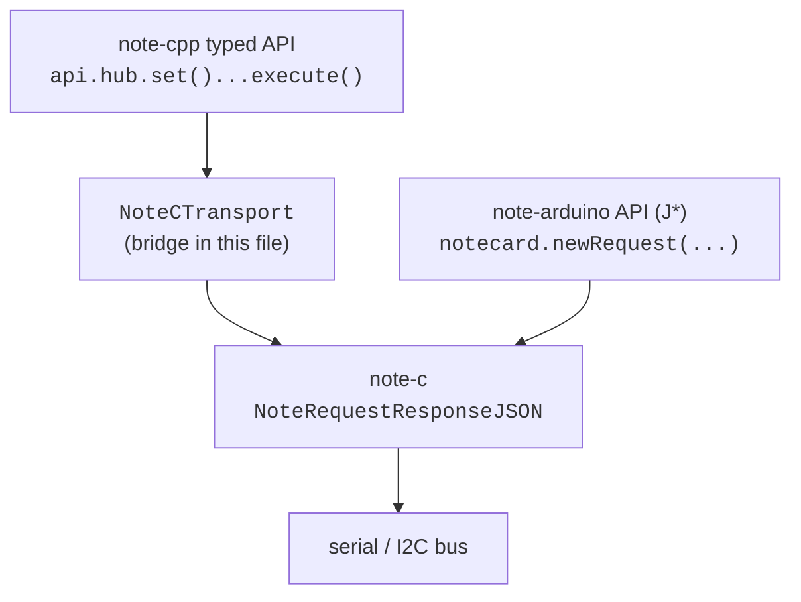

# note-arduino + note-cpp coexistence

Run note-cpp's typed API on top of an existing
[note-arduino](https://github.com/blues/note-arduino) project, without
ripping out the existing transport setup or replacing every J*-shaped
call site.

## Why coexist?

- **Incremental migration.** Existing call sites keep working as-is;
  new code uses the typed Api alongside.
- **Single Notecard, no conflicts.** Both libraries route through the
  same `NoteRequestResponseJSON` entry point — there's only ever one
  in-flight request.
- **No double-init.** `notecard.begin()` configures note-c's HAL once;
  the note-cpp bridge piggybacks on that setup.

For a clean room "no note-arduino at all" scenario, prefer
[`examples/arduino/migration/`](../migration/) — it shows the typed
API in isolation. For a project that's actively migrating, this
example is the bridge.

## How it works



The bridge implements `note::ITransact` by forwarding each request to
`NoteRequestResponseJSON`. note-arduino's J* methods already call into
that same function internally, so the two API surfaces share one
underlying transport without contention.

## Namespace gotcha

note-arduino exposes a global `Notecard`; note-cpp scopes its own
under `note::Notecard`. To keep both visible without ambiguity, the
sketch sets `#define NOTE_USING_NAMESPACE 0` before including
`<note/api.hpp>` so note-cpp does NOT pull its names into the global
namespace. After that:

```cpp
Notecard notecard;            // note-arduino — global
note::Notecard cpp_nc(...);   // note-cpp — qualified
```

If you skip the macro, the compiler will complain at the first use
of either name.

## Real-project checklist

1. Replace the `// stub:` block with `#include <Notecard.h>` from
   note-arduino. The `NoteRequestResponseJSON` declaration comes
   along with note-c, which note-arduino pulls in.
2. Pick a real `JsonBackend` — the `MockBackend` here is a placeholder
   that emits JSON via `std::string` for compile-only validation. For
   runtime use, wrap whichever JSON library your project already uses
   (cJSON, nlohmann, RapidJSON). See `tests/integration/` for working
   backends.
3. Decide which call sites to migrate first. The bridge stays in
   place; old and new code share the same `notecard`.

## Building

```bash
pio run -d examples/arduino/note-arduino-bridge
```

The CI matrix builds this example in the `pio-build` job alongside
`examples/arduino/migration/`.
