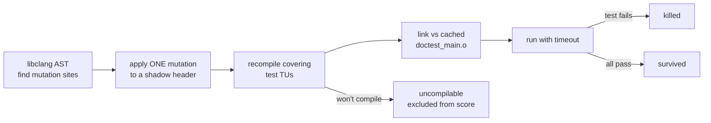

# Mutation testing

Coverage tells you a line *executed*. It can't tell you whether a test would
*notice* if that line were wrong. Mutation testing measures the difference —
test **strength**, not test reach.

The harness deliberately corrupts one operator or literal at a time in the
correctness-critical headers, rebuilds the covering host tests, and runs them:

- the mutant is **killed** if a test fails — good, an assertion caught the change;
- it **survived** if every test still passes — a weak/missing assertion, *or* an
  equivalent mutant that changes no observable behaviour.

A surviving mutant on a critical path is the signal. **The durable deliverable
is the assertion it drives** — a normal, permanent unit test added to the suite
that would have caught the corruption. The mutants are ephemeral (applied to a
throwaway overlay, never to the tree); the assertions live forever. This mirrors
fuzzing, whose durable artifact is its committed corpus.

## Running it

```sh
./ci.sh --mutate                 # PoC set (cobs + retry); on-demand audit
./ci.sh --mutate --all           # every configured target
./ci.sh --mutate --target jsonb  # one target
python3 tools/mutation-testing/mutate.py --list-targets
```

Requires a C++ compiler (`c++` by default; override with `CXX`) and the
`clang.cindex` Python bindings (`python3 -m pip install libclang`). The harness
self-skips with a clear message if either is missing, so `./ci.sh --mutate` is
safe to invoke anywhere.

**This is an on-demand audit, not a per-commit gate.** It is minutes long, and
scores are inherently noisy because equivalent mutants survive legitimately and
need human triage — a hard gate would false-fail. It exits 0 even with
survivors; run it after touching the parsers, framing, or retry logic, then
triage the survivor list.

## How it works



- **Sites come from the AST**, not regex: a comparison `<` is mutated, a template
  `Foo<int>` `<` is not, and strings/comments are never touched. Operators:
  relational/equality/logical/arithmetic swaps, integer-literal `n±1` boundaries,
  bool-literal flips, drop unary `!`, and standalone statement deletion.
- **Shadow include tree.** Each mutant gets a private mirror of `include/` built
  from symlinks, with only the mutated header materialised as a real file, used
  as the *sole* include root. This makes both `<note/link/cobs.hpp>` and quoted
  `"link/cobs.hpp"` includes resolve to the mutated copy uniformly — a flat
  `-I overlay -I include` would let quote-includes slip past to the real header
  and double-include it (`#pragma once` dedupes by file identity).
- **Cached objects.** `doctest_main.o` + `alloc_counter.o` are compiled once; a
  mutation only changes a header, so per mutant we recompile just the covering
  test TU(s).
- **Short-circuit.** Test TUs run fastest-first and stop at the first failure, so
  a mutant killed by the quick unit test never pays the heavier TUs' compile.
- A process pool runs ~(cores − 2) workers; a per-mutant run timeout guards
  mutations that induce an infinite loop.

## Targets

`TARGETS` in `mutate.py` maps each header to the test TU(s) that exercise it.
The mapping must list **every** TU that directly asserts the target's
behaviour, not just the obvious unit test — a mutant is only killed if a
*rebuilt* test fails. (e.g. `cobs_encoded_length` is asserted in
`test_binary_execute.cpp`, not `test_cobs.cpp`; omitting it produces false
survivors.) Verify a new target's mapping against host coverage
(`./ci.sh --coverage`).

For a large header where only one function is the target, set `regions` (a list
of inclusive 1-based line ranges) so mutation is restricted to it — the
`dispatch` target uses this to focus on `notecard.hpp`'s execute/begin_execute
path-selection core instead of mutating all ~2000 lines. Omit `regions` to
sweep the whole file.

## Triage

For each survivor, decide:

- **Real gap** → add a permanent assertion to the covering test that pins the
  behaviour the mutant broke. Re-run; the survivor should become killed.
- **Equivalent mutant** → the corruption changes no observable behaviour, so no
  test can or should catch it. Common cases here: a default member initialiser
  overwritten by a constructor's `reset()`, a `<`↔`<=` inside a `min`-style
  ternary that picks the same value at equality, or a redundant early flush.
  These are expected and left alone.

Some real defects only surface under a sanitizer (e.g. a deleted bounds-flush
that overflows a fixed buffer with adversarial input). Those belong to the
ASan/UBSan fuzz lane (`./ci.sh --fuzz`), not to a deterministic assertion.
